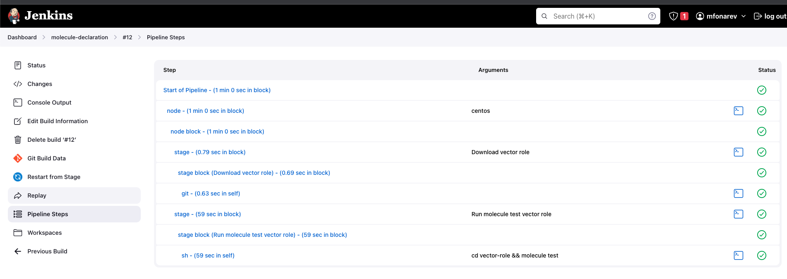

# Подготовка к выполнению

> 1. Создать два VM: для jenkins-master и jenkins-agent.


> 2. Установить Jenkins при помощи playbook.

Написал плейбук и установил (ссылка на плейбук ниже)

[jenkins_install_playbook](dz10/jenkins_ansible/playbook/install_jenkins.yml)

> 3,4 Запустить и проверить работоспособность. Сделать первоначальную настройку.

Только потом увидел что уже есть к заданию готовый плейбук, чтобы развернуть инфру, делал из собственного плейбука.

На агента доставил отдельно ручками молекул и докер

Главная нода


Окно с нодами


На агента доставил отдельно ручками молекул и докер

# Основная часть

> 1. Сделать Freestyle Job, который будет запускать molecule test из любого вашего репозитория с ролью.

Окно с freestyle job


Запуск freestyle job


Вывод консоли jenkins
```sh
Started by user mfonarev
Running as SYSTEM
Building remotely on mfonarev_agent (centos) in workspace /home/admin/workspace/molecule_test_1
The recommended git tool is: NONE
No credentials specified
 > git rev-parse --resolve-git-dir /home/admin/workspace/molecule_test_1/.git # timeout=10
Fetching changes from the remote Git repository
 > git config remote.origin.url https://github.com/fonru/ansible-vector.git # timeout=10
Fetching upstream changes from https://github.com/fonru/ansible-vector.git
 > git --version # timeout=10
 > git --version # 'git version 2.39.1'
 > git fetch --tags --force --progress -- https://github.com/fonru/ansible-vector.git +refs/heads/*:refs/remotes/origin/* # timeout=10
Seen branch in repository origin/main
Seen 1 remote branch
 > git show-ref --tags -d # timeout=10
Checking out Revision bfbecc2fac256a9d37eebb1039229a967a94c8e4 (origin/main)
 > git config core.sparsecheckout # timeout=10
 > git checkout -f bfbecc2fac256a9d37eebb1039229a967a94c8e4 # timeout=10
Commit message: "Update molecule.yml"
 > git rev-list --no-walk bfbecc2fac256a9d37eebb1039229a967a94c8e4 # timeout=10
[molecule_test_1] $ /bin/sh -xe /tmp/jenkins16611066043464916857.sh
+ cd vector-role
+ molecule test
[DEPRECATION WARNING]: Ansible will require Python 3.8 or newer on the 
controller starting with Ansible 2.12. Current version: 3.6.8 (default, Jan 25 
2023, 15:03:30) [GCC 8.5.0 20210514 (Red Hat 8.5.0-18)]. This feature will be 
removed from ansible-core in version 2.12. Deprecation warnings can be disabled
 by setting deprecation_warnings=False in ansible.cfg.
INFO     default scenario test matrix: dependency, lint, cleanup, destroy, syntax, create, prepare, converge, idempotence, side_effect, verify, cleanup, destroy
INFO     Performing prerun...
INFO     Set ANSIBLE_LIBRARY=/home/admin/.cache/ansible-compat/acbb0e/modules:/home/admin/.ansible/plugins/modules:/usr/share/ansible/plugins/modules
INFO     Set ANSIBLE_COLLECTIONS_PATH=/home/admin/.cache/ansible-compat/acbb0e/collections:/home/admin/.ansible/collections:/usr/share/ansible/collections
INFO     Set ANSIBLE_ROLES_PATH=/home/admin/.cache/ansible-compat/acbb0e/roles:/home/admin/.ansible/roles:/usr/share/ansible/roles:/etc/ansible/roles
INFO     Using /home/admin/.ansible/roles/my_namespace.vector symlink to current repository in order to enable Ansible to find the role using its expected full name.
INFO     Running default > dependency
WARNING  Skipping, missing the requirements file.
WARNING  Skipping, missing the requirements file.
INFO     Running default > lint
INFO     Lint is disabled.
INFO     Running default > cleanup
WARNING  Skipping, cleanup playbook not configured.
INFO     Running default > destroy
INFO     Sanity checks: 'docker'
[DEPRECATION WARNING]: Ansible will require Python 3.8 or newer on the
controller starting with Ansible 2.12. Current version: 3.6.8 (default, Jan 25
2023, 15:03:30) [GCC 8.5.0 20210514 (Red Hat 8.5.0-18)]. This feature will be
removed from ansible-core in version 2.12. Deprecation warnings can be disabled
 by setting deprecation_warnings=False in ansible.cfg.

PLAY [Destroy] *****************************************************************

TASK [Destroy molecule instance(s)] ********************************************
changed: [localhost] => (item=Ubuntu_latest)

TASK [Wait for instance(s) deletion to complete] *******************************
FAILED - RETRYING: Wait for instance(s) deletion to complete (300 retries left).
ok: [localhost] => (item=Ubuntu_latest)

TASK [Delete docker networks(s)] ***********************************************

PLAY RECAP *********************************************************************
localhost                  : ok=2    changed=1    unreachable=0    failed=0    skipped=1    rescued=0    ignored=0

INFO     Running default > syntax
[DEPRECATION WARNING]: Ansible will require Python 3.8 or newer on the
controller starting with Ansible 2.12. Current version: 3.6.8 (default, Jan 25
2023, 15:03:30) [GCC 8.5.0 20210514 (Red Hat 8.5.0-18)]. This feature will be
removed from ansible-core in version 2.12. Deprecation warnings can be disabled
 by setting deprecation_warnings=False in ansible.cfg.

playbook: /home/admin/workspace/molecule_test_1/vector-role/molecule/default/converge.yml
INFO     Running default > create
[DEPRECATION WARNING]: Ansible will require Python 3.8 or newer on the
controller starting with Ansible 2.12. Current version: 3.6.8 (default, Jan 25
2023, 15:03:30) [GCC 8.5.0 20210514 (Red Hat 8.5.0-18)]. This feature will be
removed from ansible-core in version 2.12. Deprecation warnings can be disabled
 by setting deprecation_warnings=False in ansible.cfg.

PLAY [Create] ******************************************************************

TASK [Log into a Docker registry] **********************************************
skipping: [localhost] => (item=None)
skipping: [localhost]

TASK [Check presence of custom Dockerfiles] ************************************
ok: [localhost] => (item={'command': '/lib/systemd/systemd', 'dockerfile': 'Dockerfile', 'image': 'ubuntu:latest', 'name': 'Ubuntu_latest', 'pre_build_image': False, 'privileged': True})

TASK [Create Dockerfiles from image names] *************************************
changed: [localhost] => (item={'command': '/lib/systemd/systemd', 'dockerfile': 'Dockerfile', 'image': 'ubuntu:latest', 'name': 'Ubuntu_latest', 'pre_build_image': False, 'privileged': True})

TASK [Discover local Docker images] ********************************************
ok: [localhost] => (item={'diff': [], 'dest': '/home/admin/.cache/molecule/vector-role/default/Dockerfile_ubuntu_latest', 'src': '/home/admin/.ansible/tmp/ansible-tmp-1678011504.1141667-182186-4601020884615/source', 'md5sum': 'dd3ad5a9e225e42cf2fd284f5d0cd7d4', 'checksum': 'a7c1a5ca7ef6bb924d45d41f8ede7885da04b3c8', 'changed': True, 'uid': 1000, 'gid': 1000, 'owner': 'admin', 'group': 'admin', 'mode': '0600', 'state': 'file', 'secontext': 'unconfined_u:object_r:cache_home_t:s0', 'size': 704, 'invocation': {'module_args': {'src': '/home/admin/.ansible/tmp/ansible-tmp-1678011504.1141667-182186-4601020884615/source', 'dest': '/home/admin/.cache/molecule/vector-role/default/Dockerfile_ubuntu_latest', 'mode': '0600', 'follow': False, '_original_basename': 'Dockerfile', 'checksum': 'a7c1a5ca7ef6bb924d45d41f8ede7885da04b3c8', 'backup': False, 'force': True, 'unsafe_writes': False, 'content': None, 'validate': None, 'directory_mode': None, 'remote_src': None, 'local_follow': None, 'owner': None, 'group': None, 'seuser': None, 'serole': None, 'selevel': None, 'setype': None, 'attributes': None}}, 'failed': False, 'item': {'command': '/lib/systemd/systemd', 'dockerfile': 'Dockerfile', 'image': 'ubuntu:latest', 'name': 'Ubuntu_latest', 'pre_build_image': False, 'privileged': True}, 'ansible_loop_var': 'item', 'i': 0, 'ansible_index_var': 'i'})

TASK [Build an Ansible compatible image (new)] *********************************
ok: [localhost] => (item=molecule_local/ubuntu:latest)

TASK [Create docker network(s)] ************************************************

TASK [Determine the CMD directives] ********************************************
ok: [localhost] => (item={'command': '/lib/systemd/systemd', 'dockerfile': 'Dockerfile', 'image': 'ubuntu:latest', 'name': 'Ubuntu_latest', 'pre_build_image': False, 'privileged': True})

TASK [Create molecule instance(s)] *********************************************
changed: [localhost] => (item=Ubuntu_latest)

TASK [Wait for instance(s) creation to complete] *******************************
FAILED - RETRYING: Wait for instance(s) creation to complete (300 retries left).
changed: [localhost] => (item={'started': 1, 'finished': 0, 'ansible_job_id': '674790532152.182292', 'results_file': '/home/admin/.ansible_async/674790532152.182292', 'changed': True, 'failed': False, 'item': {'command': '/lib/systemd/systemd', 'dockerfile': 'Dockerfile', 'image': 'ubuntu:latest', 'name': 'Ubuntu_latest', 'pre_build_image': False, 'privileged': True}, 'ansible_loop_var': 'item'})

PLAY RECAP *********************************************************************
localhost                  : ok=7    changed=3    unreachable=0    failed=0    skipped=2    rescued=0    ignored=0

INFO     Running default > prepare
WARNING  Skipping, prepare playbook not configured.
INFO     Running default > converge
[DEPRECATION WARNING]: Ansible will require Python 3.8 or newer on the
controller starting with Ansible 2.12. Current version: 3.6.8 (default, Jan 25
2023, 15:03:30) [GCC 8.5.0 20210514 (Red Hat 8.5.0-18)]. This feature will be
removed from ansible-core in version 2.12. Deprecation warnings can be disabled
 by setting deprecation_warnings=False in ansible.cfg.

PLAY [Converge] ****************************************************************

TASK [Gathering Facts] *********************************************************
ok: [Ubuntu_latest]

TASK [Include vector-role] *****************************************************

TASK [vector-role : Download and install vector packages for UBUNTU] ***********
changed: [Ubuntu_latest]

TASK [vector-role : Download and install vector packages for Centos8] **********
skipping: [Ubuntu_latest]

RUNNING HANDLER [vector-role : Start Vector service] ***************************
changed: [Ubuntu_latest]

PLAY RECAP *********************************************************************
Ubuntu_latest              : ok=3    changed=2    unreachable=0    failed=0    skipped=1    rescued=0    ignored=0

INFO     Running default > idempotence
[DEPRECATION WARNING]: Ansible will require Python 3.8 or newer on the
controller starting with Ansible 2.12. Current version: 3.6.8 (default, Jan 25
2023, 15:03:30) [GCC 8.5.0 20210514 (Red Hat 8.5.0-18)]. This feature will be
removed from ansible-core in version 2.12. Deprecation warnings can be disabled
 by setting deprecation_warnings=False in ansible.cfg.

PLAY [Converge] ****************************************************************

TASK [Gathering Facts] *********************************************************
ok: [Ubuntu_latest]

TASK [Include vector-role] *****************************************************

TASK [vector-role : Download and install vector packages for UBUNTU] ***********
ok: [Ubuntu_latest]

TASK [vector-role : Download and install vector packages for Centos8] **********
skipping: [Ubuntu_latest]

PLAY RECAP *********************************************************************
Ubuntu_latest              : ok=2    changed=0    unreachable=0    failed=0    skipped=1    rescued=0    ignored=0

INFO     Idempotence completed successfully.
INFO     Running default > side_effect
WARNING  Skipping, side effect playbook not configured.
INFO     Running default > verify
INFO     Running Ansible Verifier
[DEPRECATION WARNING]: Ansible will require Python 3.8 or newer on the
controller starting with Ansible 2.12. Current version: 3.6.8 (default, Jan 25
2023, 15:03:30) [GCC 8.5.0 20210514 (Red Hat 8.5.0-18)]. This feature will be
removed from ansible-core in version 2.12. Deprecation warnings can be disabled
 by setting deprecation_warnings=False in ansible.cfg.

PLAY [Verify] ******************************************************************

TASK [Gather Local Services] ***************************************************
ok: [Ubuntu_latest]

TASK [Vector service assert] ***************************************************
ok: [Ubuntu_latest] => {
    "changed": false,
    "msg": "All assertions passed"
}

PLAY RECAP *********************************************************************
Ubuntu_latest              : ok=2    changed=0    unreachable=0    failed=0    skipped=0    rescued=0    ignored=0

INFO     Verifier completed successfully.
INFO     Running default > cleanup
WARNING  Skipping, cleanup playbook not configured.
INFO     Running default > destroy
[DEPRECATION WARNING]: Ansible will require Python 3.8 or newer on the
controller starting with Ansible 2.12. Current version: 3.6.8 (default, Jan 25
2023, 15:03:30) [GCC 8.5.0 20210514 (Red Hat 8.5.0-18)]. This feature will be
removed from ansible-core in version 2.12. Deprecation warnings can be disabled
 by setting deprecation_warnings=False in ansible.cfg.

PLAY [Destroy] *****************************************************************

TASK [Destroy molecule instance(s)] ********************************************
changed: [localhost] => (item=Ubuntu_latest)

TASK [Wait for instance(s) deletion to complete] *******************************
FAILED - RETRYING: Wait for instance(s) deletion to complete (300 retries left).
changed: [localhost] => (item=Ubuntu_latest)

TASK [Delete docker networks(s)] ***********************************************

PLAY RECAP *********************************************************************
localhost                  : ok=2    changed=2    unreachable=0    failed=0    skipped=1    rescued=0    ignored=0

INFO     Pruning extra files from scenario ephemeral directory
Finished: SUCCESS
```

> 2. Сделать Declarative Pipeline Job, который будет запускать molecule test из любого вашего репозитория с ролью.

Окно с Declarative job


Запуск Declarative job


Вывод консоли jenkins
```sh
Started by user mfonarev
[Pipeline] Start of Pipeline
[Pipeline] node
Running on mfonarev_agent in /home/admin/workspace/molecule-declaration
[Pipeline] {
[Pipeline] stage
[Pipeline] { (Download vector role)
[Pipeline] git
The recommended git tool is: NONE
No credentials specified
Fetching changes from the remote Git repository
Checking out Revision bfbecc2fac256a9d37eebb1039229a967a94c8e4 (refs/remotes/origin/main)
Commit message: "Update molecule.yml"
 > git rev-parse --resolve-git-dir /home/admin/workspace/molecule-declaration/.git # timeout=10
 > git config remote.origin.url https://github.com/fonru/ansible-vector.git # timeout=10
Fetching upstream changes from https://github.com/fonru/ansible-vector.git
 > git --version # timeout=10
 > git --version # 'git version 2.39.1'
 > git fetch --tags --force --progress -- https://github.com/fonru/ansible-vector.git +refs/heads/*:refs/remotes/origin/* # timeout=10
 > git rev-parse refs/remotes/origin/main^{commit} # timeout=10
 > git config core.sparsecheckout # timeout=10
 > git checkout -f bfbecc2fac256a9d37eebb1039229a967a94c8e4 # timeout=10
 > git branch -a -v --no-abbrev # timeout=10
 > git branch -D main # timeout=10
 > git checkout -b main bfbecc2fac256a9d37eebb1039229a967a94c8e4 # timeout=10
 > git rev-list --no-walk bfbecc2fac256a9d37eebb1039229a967a94c8e4 # timeout=10
[Pipeline] }
[Pipeline] // stage
[Pipeline] stage
[Pipeline] { (Run molecule test vector role)
[Pipeline] sh
+ cd vector-role
+ molecule test
[DEPRECATION WARNING]: Ansible will require Python 3.8 or newer on the 
controller starting with Ansible 2.12. Current version: 3.6.8 (default, Jan 25 
2023, 15:03:30) [GCC 8.5.0 20210514 (Red Hat 8.5.0-18)]. This feature will be 
removed from ansible-core in version 2.12. Deprecation warnings can be disabled
 by setting deprecation_warnings=False in ansible.cfg.
INFO     default scenario test matrix: dependency, lint, cleanup, destroy, syntax, create, prepare, converge, idempotence, side_effect, verify, cleanup, destroy
INFO     Performing prerun...
INFO     Set ANSIBLE_LIBRARY=/home/admin/.cache/ansible-compat/82309f/modules:/home/admin/.ansible/plugins/modules:/usr/share/ansible/plugins/modules
INFO     Set ANSIBLE_COLLECTIONS_PATH=/home/admin/.cache/ansible-compat/82309f/collections:/home/admin/.ansible/collections:/usr/share/ansible/collections
INFO     Set ANSIBLE_ROLES_PATH=/home/admin/.cache/ansible-compat/82309f/roles:/home/admin/.ansible/roles:/usr/share/ansible/roles:/etc/ansible/roles
INFO     Using /home/admin/.ansible/roles/my_namespace.vector symlink to current repository in order to enable Ansible to find the role using its expected full name.
INFO     Running default > dependency
INFO     Running ansible-galaxy collection install -v community.docker:>=1.9.1
WARNING  Skipping, missing the requirements file.
WARNING  Skipping, missing the requirements file.
INFO     Running default > lint
INFO     Lint is disabled.
INFO     Running default > cleanup
WARNING  Skipping, cleanup playbook not configured.
INFO     Running default > destroy
INFO     Sanity checks: 'docker'
[DEPRECATION WARNING]: Ansible will require Python 3.8 or newer on the
controller starting with Ansible 2.12. Current version: 3.6.8 (default, Jan 25
2023, 15:03:30) [GCC 8.5.0 20210514 (Red Hat 8.5.0-18)]. This feature will be
removed from ansible-core in version 2.12. Deprecation warnings can be disabled
 by setting deprecation_warnings=False in ansible.cfg.

PLAY [Destroy] *****************************************************************

TASK [Destroy molecule instance(s)] ********************************************
changed: [localhost] => (item=Ubuntu_latest)

TASK [Wait for instance(s) deletion to complete] *******************************
FAILED - RETRYING: Wait for instance(s) deletion to complete (300 retries left).
ok: [localhost] => (item=Ubuntu_latest)

TASK [Delete docker networks(s)] ***********************************************

PLAY RECAP *********************************************************************
localhost                  : ok=2    changed=1    unreachable=0    failed=0    skipped=1    rescued=0    ignored=0

INFO     Running default > syntax
[DEPRECATION WARNING]: Ansible will require Python 3.8 or newer on the
controller starting with Ansible 2.12. Current version: 3.6.8 (default, Jan 25
2023, 15:03:30) [GCC 8.5.0 20210514 (Red Hat 8.5.0-18)]. This feature will be
removed from ansible-core in version 2.12. Deprecation warnings can be disabled
 by setting deprecation_warnings=False in ansible.cfg.

playbook: /home/admin/workspace/molecule-declaration/vector-role/molecule/default/converge.yml
INFO     Running default > create
[DEPRECATION WARNING]: Ansible will require Python 3.8 or newer on the
controller starting with Ansible 2.12. Current version: 3.6.8 (default, Jan 25
2023, 15:03:30) [GCC 8.5.0 20210514 (Red Hat 8.5.0-18)]. This feature will be
removed from ansible-core in version 2.12. Deprecation warnings can be disabled
 by setting deprecation_warnings=False in ansible.cfg.

PLAY [Create] ******************************************************************

TASK [Log into a Docker registry] **********************************************
skipping: [localhost] => (item=None)
skipping: [localhost]

TASK [Check presence of custom Dockerfiles] ************************************
ok: [localhost] => (item={'command': '/lib/systemd/systemd', 'dockerfile': 'Dockerfile', 'image': 'ubuntu:latest', 'name': 'Ubuntu_latest', 'pre_build_image': False, 'privileged': True})

TASK [Create Dockerfiles from image names] *************************************
changed: [localhost] => (item={'command': '/lib/systemd/systemd', 'dockerfile': 'Dockerfile', 'image': 'ubuntu:latest', 'name': 'Ubuntu_latest', 'pre_build_image': False, 'privileged': True})

TASK [Discover local Docker images] ********************************************
ok: [localhost] => (item={'diff': [], 'dest': '/home/admin/.cache/molecule/vector-role/default/Dockerfile_ubuntu_latest', 'src': '/home/admin/.ansible/tmp/ansible-tmp-1678013283.2166836-185483-30072318992825/source', 'md5sum': 'dd3ad5a9e225e42cf2fd284f5d0cd7d4', 'checksum': 'a7c1a5ca7ef6bb924d45d41f8ede7885da04b3c8', 'changed': True, 'uid': 1000, 'gid': 1000, 'owner': 'admin', 'group': 'admin', 'mode': '0600', 'state': 'file', 'secontext': 'unconfined_u:object_r:cache_home_t:s0', 'size': 704, 'invocation': {'module_args': {'src': '/home/admin/.ansible/tmp/ansible-tmp-1678013283.2166836-185483-30072318992825/source', 'dest': '/home/admin/.cache/molecule/vector-role/default/Dockerfile_ubuntu_latest', 'mode': '0600', 'follow': False, '_original_basename': 'Dockerfile', 'checksum': 'a7c1a5ca7ef6bb924d45d41f8ede7885da04b3c8', 'backup': False, 'force': True, 'unsafe_writes': False, 'content': None, 'validate': None, 'directory_mode': None, 'remote_src': None, 'local_follow': None, 'owner': None, 'group': None, 'seuser': None, 'serole': None, 'selevel': None, 'setype': None, 'attributes': None}}, 'failed': False, 'item': {'command': '/lib/systemd/systemd', 'dockerfile': 'Dockerfile', 'image': 'ubuntu:latest', 'name': 'Ubuntu_latest', 'pre_build_image': False, 'privileged': True}, 'ansible_loop_var': 'item', 'i': 0, 'ansible_index_var': 'i'})

TASK [Build an Ansible compatible image (new)] *********************************
ok: [localhost] => (item=molecule_local/ubuntu:latest)

TASK [Create docker network(s)] ************************************************

TASK [Determine the CMD directives] ********************************************
ok: [localhost] => (item={'command': '/lib/systemd/systemd', 'dockerfile': 'Dockerfile', 'image': 'ubuntu:latest', 'name': 'Ubuntu_latest', 'pre_build_image': False, 'privileged': True})

TASK [Create molecule instance(s)] *********************************************
changed: [localhost] => (item=Ubuntu_latest)

TASK [Wait for instance(s) creation to complete] *******************************
FAILED - RETRYING: Wait for instance(s) creation to complete (300 retries left).
changed: [localhost] => (item={'started': 1, 'finished': 0, 'ansible_job_id': '163178614319.185591', 'results_file': '/home/admin/.ansible_async/163178614319.185591', 'changed': True, 'failed': False, 'item': {'command': '/lib/systemd/systemd', 'dockerfile': 'Dockerfile', 'image': 'ubuntu:latest', 'name': 'Ubuntu_latest', 'pre_build_image': False, 'privileged': True}, 'ansible_loop_var': 'item'})

PLAY RECAP *********************************************************************
localhost                  : ok=7    changed=3    unreachable=0    failed=0    skipped=2    rescued=0    ignored=0

INFO     Running default > prepare
WARNING  Skipping, prepare playbook not configured.
INFO     Running default > converge
[DEPRECATION WARNING]: Ansible will require Python 3.8 or newer on the
controller starting with Ansible 2.12. Current version: 3.6.8 (default, Jan 25
2023, 15:03:30) [GCC 8.5.0 20210514 (Red Hat 8.5.0-18)]. This feature will be
removed from ansible-core in version 2.12. Deprecation warnings can be disabled
 by setting deprecation_warnings=False in ansible.cfg.

PLAY [Converge] ****************************************************************

TASK [Gathering Facts] *********************************************************
ok: [Ubuntu_latest]

TASK [Include vector-role] *****************************************************

TASK [vector-role : Download and install vector packages for UBUNTU] ***********
changed: [Ubuntu_latest]

TASK [vector-role : Download and install vector packages for Centos8] **********
skipping: [Ubuntu_latest]

RUNNING HANDLER [vector-role : Start Vector service] ***************************
changed: [Ubuntu_latest]

PLAY RECAP *********************************************************************
Ubuntu_latest              : ok=3    changed=2    unreachable=0    failed=0    skipped=1    rescued=0    ignored=0

INFO     Running default > idempotence
[DEPRECATION WARNING]: Ansible will require Python 3.8 or newer on the
controller starting with Ansible 2.12. Current version: 3.6.8 (default, Jan 25
2023, 15:03:30) [GCC 8.5.0 20210514 (Red Hat 8.5.0-18)]. This feature will be
removed from ansible-core in version 2.12. Deprecation warnings can be disabled
 by setting deprecation_warnings=False in ansible.cfg.

PLAY [Converge] ****************************************************************

TASK [Gathering Facts] *********************************************************
ok: [Ubuntu_latest]

TASK [Include vector-role] *****************************************************

TASK [vector-role : Download and install vector packages for UBUNTU] ***********
ok: [Ubuntu_latest]

TASK [vector-role : Download and install vector packages for Centos8] **********
skipping: [Ubuntu_latest]

PLAY RECAP *********************************************************************
Ubuntu_latest              : ok=2    changed=0    unreachable=0    failed=0    skipped=1    rescued=0    ignored=0

INFO     Idempotence completed successfully.
INFO     Running default > side_effect
WARNING  Skipping, side effect playbook not configured.
INFO     Running default > verify
INFO     Running Ansible Verifier
[DEPRECATION WARNING]: Ansible will require Python 3.8 or newer on the
controller starting with Ansible 2.12. Current version: 3.6.8 (default, Jan 25
2023, 15:03:30) [GCC 8.5.0 20210514 (Red Hat 8.5.0-18)]. This feature will be
removed from ansible-core in version 2.12. Deprecation warnings can be disabled
 by setting deprecation_warnings=False in ansible.cfg.

PLAY [Verify] ******************************************************************

TASK [Gather Local Services] ***************************************************
ok: [Ubuntu_latest]

TASK [Vector service assert] ***************************************************
ok: [Ubuntu_latest] => {
    "changed": false,
    "msg": "All assertions passed"
}

PLAY RECAP *********************************************************************
Ubuntu_latest              : ok=2    changed=0    unreachable=0    failed=0    skipped=0    rescued=0    ignored=0

INFO     Verifier completed successfully.
INFO     Running default > cleanup
WARNING  Skipping, cleanup playbook not configured.
INFO     Running default > destroy
[DEPRECATION WARNING]: Ansible will require Python 3.8 or newer on the
controller starting with Ansible 2.12. Current version: 3.6.8 (default, Jan 25
2023, 15:03:30) [GCC 8.5.0 20210514 (Red Hat 8.5.0-18)]. This feature will be
removed from ansible-core in version 2.12. Deprecation warnings can be disabled
 by setting deprecation_warnings=False in ansible.cfg.

PLAY [Destroy] *****************************************************************

TASK [Destroy molecule instance(s)] ********************************************
changed: [localhost] => (item=Ubuntu_latest)

TASK [Wait for instance(s) deletion to complete] *******************************
FAILED - RETRYING: Wait for instance(s) deletion to complete (300 retries left).
changed: [localhost] => (item=Ubuntu_latest)

TASK [Delete docker networks(s)] ***********************************************

PLAY RECAP *********************************************************************
localhost                  : ok=2    changed=2    unreachable=0    failed=0    skipped=1    rescued=0    ignored=0

INFO     Pruning extra files from scenario ephemeral directory
[Pipeline] }
[Pipeline] // stage
[Pipeline] }
[Pipeline] // node
[Pipeline] End of Pipeline
Finished: SUCCESS
```

> 3. Перенести Declarative Pipeline в репозиторий в файл Jenkinsfile

[Jenkinsfile](https://github.com/fonru/jenkins/blob/main/Jenkinsfile)

> 4. Создать Multibranch Pipeline на запуск Jenkinsfile из репозитория.

Окно с multibranch job


Запуск multibranch job


> 5. Создать Scripted Pipeline, наполнить его скриптом из pipeline.

Добавил лейблы своего агента

Окно с Scripted Pipeline


> 6.7 

Ниже ссылка на ScriptedJenkinsfile. Взял за основу из задания, но пришлось немного изменить чтоб работал на моей версии Jenkins. playbook запускается тот что из репозитория aragast

[ScriptedJenkinsfile](https://github.com/fonru/jenkins/blob/main/ScriptedJenkinsfile)

Окно в выбором параметров запуска джобы


Запуск с параметром False (он же и поумолчанию)


Запуск с параметром True
