# Подготовка к выполнению

>1. В Yandex Cloud создайте новый инстанс (4CPU4RAM) на основе образа jetbrains/teamcity-server.

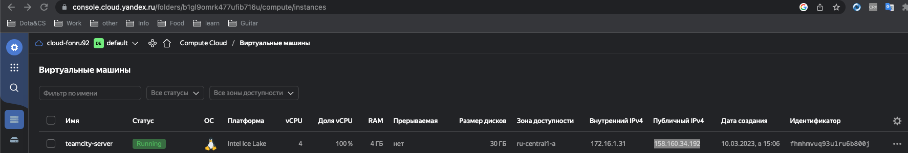

>2. Дождитесь запуска teamcity, выполните первоначальную настройку.

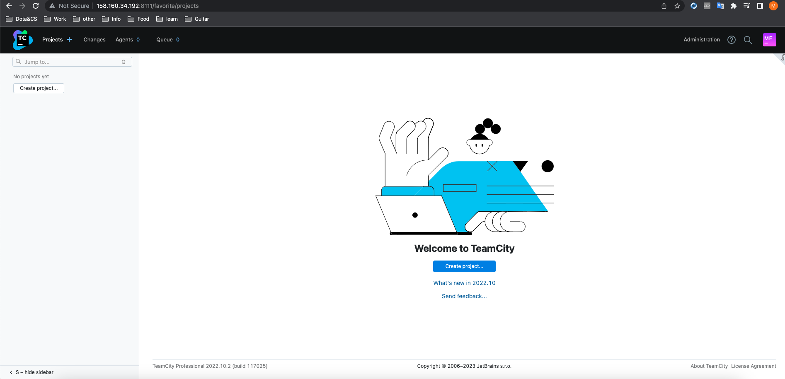

>3. Создайте ещё один инстанс (2CPU4RAM) на основе образа jetbrains/teamcity-agent. Пропишите к нему переменную окружения SERVER_URL: "http://<teamcity_url>:8111"

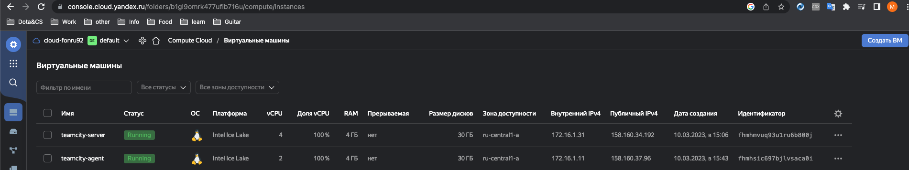

>4. Авторизуйте агент.

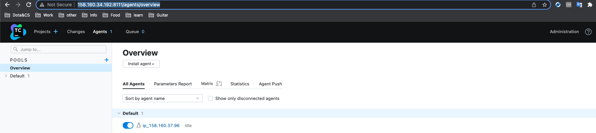

>5,6 Запускаем Nexus

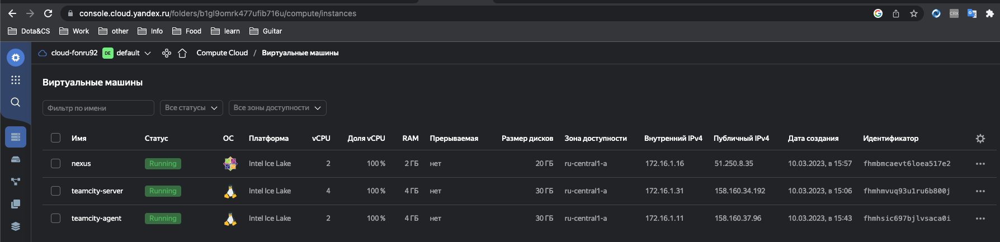

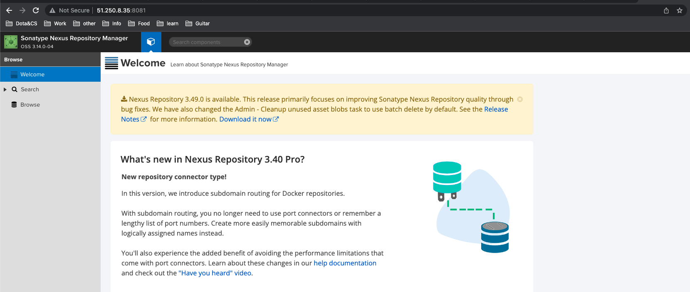

# Основная часть

>1.2 Создайте новый проект в teamcity на основе fork. Сделайте autodetect конфигурации. 

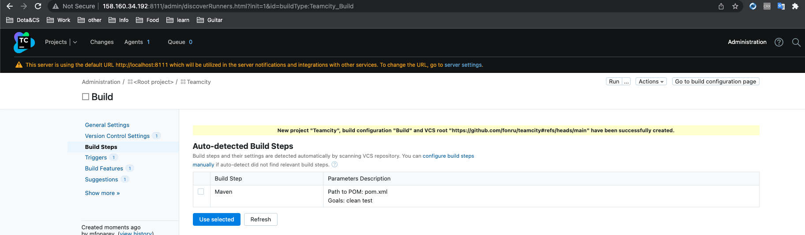

>3. Сохраните необходимые шаги, запустите первую сборку master.

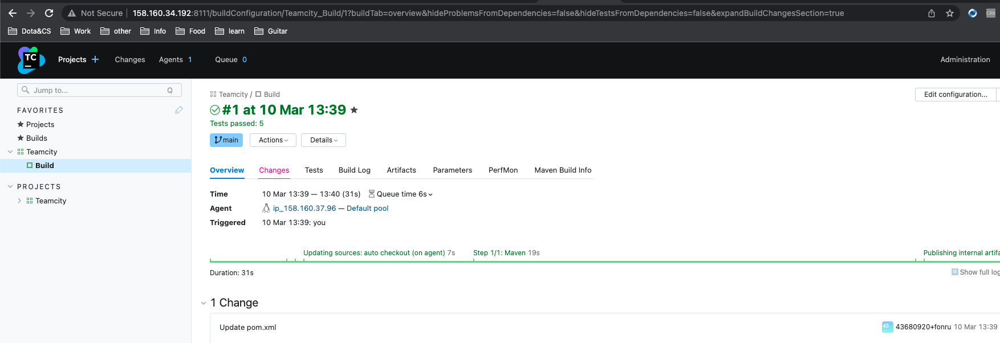

>4. Поменяйте условия сборки: если сборка по ветке master, то должен происходит mvn clean deploy, иначе mvn clean test.

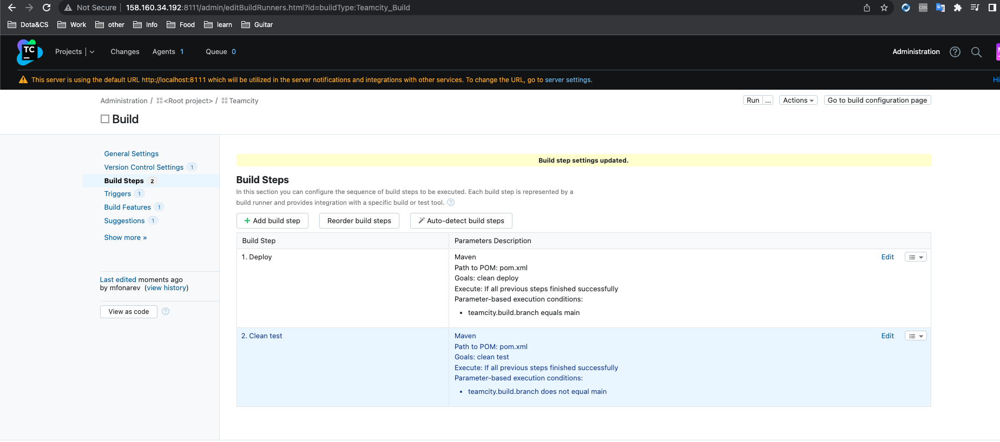

>5. Для deploy будет необходимо загрузить settings.xml в набор конфигураций maven у teamcity, предварительно записав туда креды для подключения к nexus.

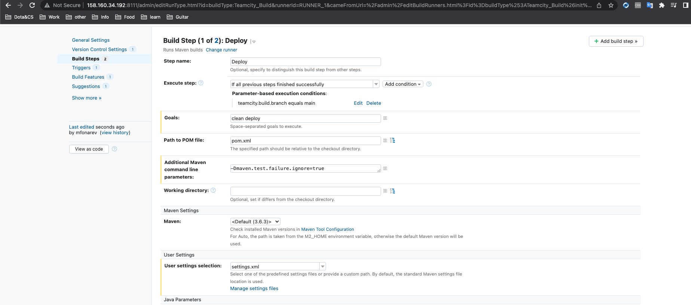

>6. В pom.xml необходимо поменять ссылки на репозиторий и nexus.

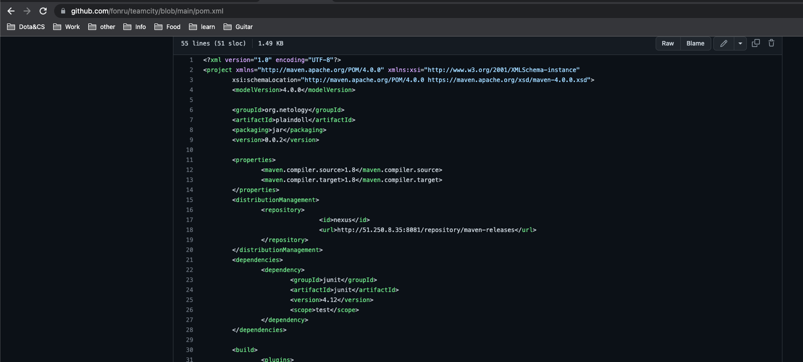

>7. Запустите сборку по master, убедитесь, что всё прошло успешно и артефакт появился в nexus.

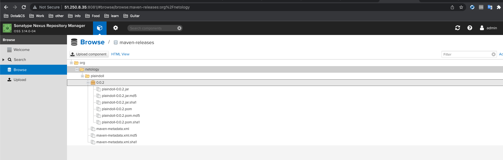

>8,9,10,11,12 Добавил новый метод sayMfonarev для класса Welcomer

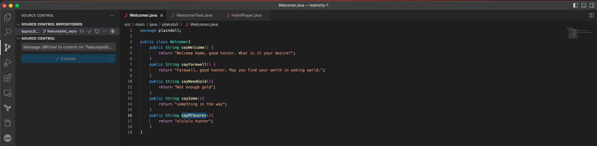

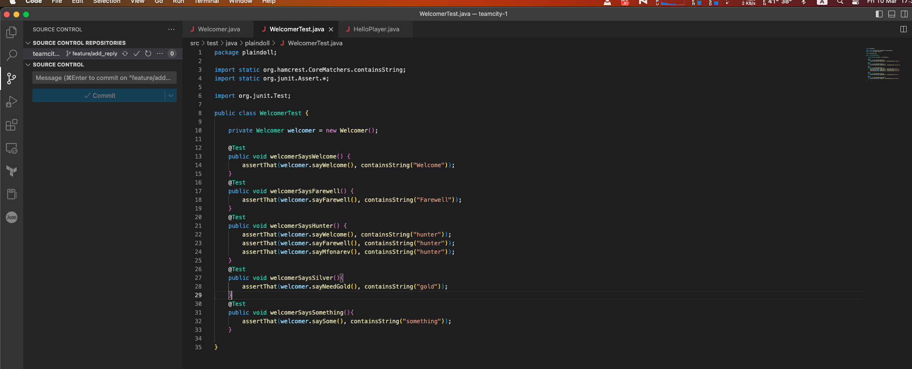

>13. Убедитесь, что сборка самостоятельно запустилась, тесты прошли успешно.

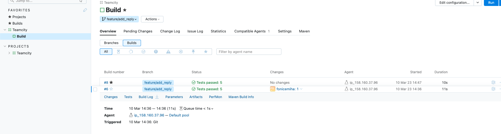

>14,15,16,17 Замержил и запустил деплой main ветки снова

>18,19 Ссылки на конфиги TeamCity и репозиторий

[teamcity-config](https://github.com/fonru/teamcity#:~:text=1%20hour%20ago-,TeamCity_Backup_20230310_145353.zip,-new%20file%3A%20TeamCity_Backup_20230310_145353)

[REPO](https://github.com/fonru/teamcity)