# Подготовка к выполнению

Созданный кубер на YC 
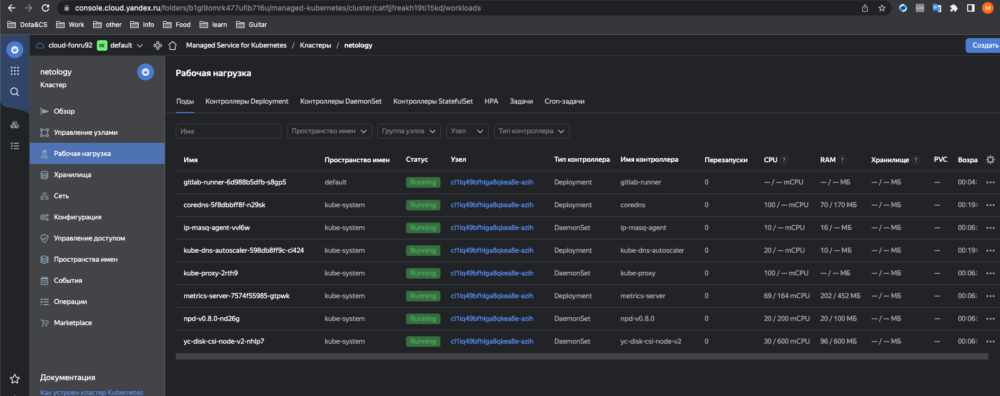

Запущенный GitLab
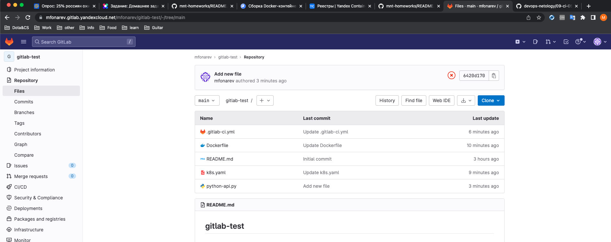

# Основная часть

## DevOps

DockerFile
```DockerFile
FROM centos:7
RUN yum update -y && \
    yum install -y python3 python3-pip && \
    yum clean all && \
    rm -rf /var/cache/yum
RUN pip3 install flask flask-jsonpify flask-restful
COPY python-api.py /opt/python_api/python-api.py
CMD ["python3", "/opt/python_api/python-api.py"]
```

gitlab-ci.yml
```gitlab-ci.yml
stages:
  - build
  - deploy

build:
  stage: build
  variables:
    DOCKER_DRIVER: overlay2
    DOCKER_TLS_CERTDIR: ""
    DOCKER_HOST: tcp://localhost:2375/
  image: cr.yandex/yc/metadata-token-docker-helper:0.2
  services:
    - docker:19.03.1-dind
  script:
    - docker build . -t cr.yandex/crp33oqlob1n6j931p6h/python-api:latest
    - docker push cr.yandex/crp33oqlob1n6j931p6h/python-api:latest

deploy:
  image: gcr.io/cloud-builders/kubectl:latest
  stage: deploy
  script:
    - kubectl config set-cluster k8s --server="$KUBE_URL" --insecure-skip-tls-verify=true
    - kubectl config set-credentials admin --token="$KUBE_TOKEN"
    - kubectl config set-context default --cluster=k8s --user=admin
    - kubectl config use-context default
    - sed -i "s/__VERSION__/gitlab-$CI_COMMIT_SHORT_SHA/" k8s.yaml
    - kubectl apply -f k8s.yaml
  only:
    - main

```

k8s.yaml
```k8s.yaml
apiVersion: v1
kind: Namespace
metadata:
  name: python-api
---
apiVersion: apps/v1
kind: Deployment
metadata:
  name: python-api-deployment
  namespace: python-api
spec:
  replicas: 1
  selector:
    matchLabels:
      app: python-api
  template:
    metadata:
      namespace: python-api
      labels:
        app: python-api
    spec:
      containers:
        - name: python-api
          image: cr.yandex/crp33oqlob1n6j931p6h/python-api:latest
          imagePullPolicy: Always
```

python-api.py
```python-api.py
from flask import Flask, request
from flask_restful import Resource, Api
from json import dumps
from flask_jsonpify import jsonify

app = Flask(__name__)
api = Api(app)

class Info(Resource):
    def get(self):
        return {'version': 3, 'method': 'GET', 'message': 'Already started'}

api.add_resource(Info, '/get_info')

if __name__ == '__main__':
     app.run(host='0.0.0.0', port='5290')
```

Успешный билд
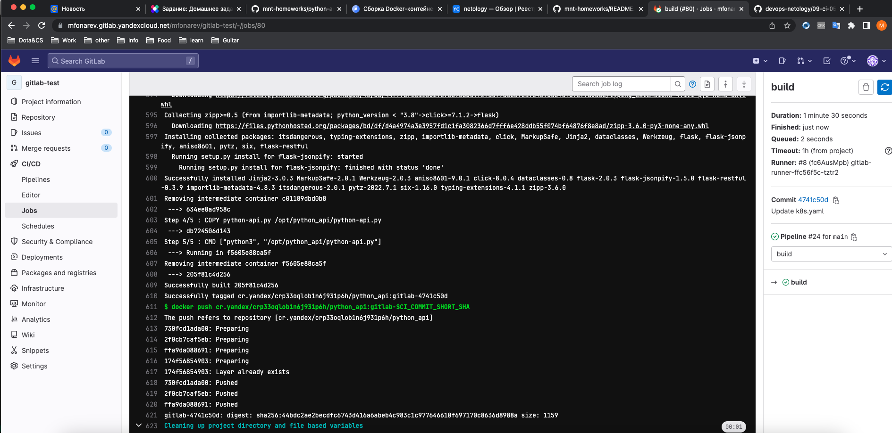

DockeRegistry yandex cloud
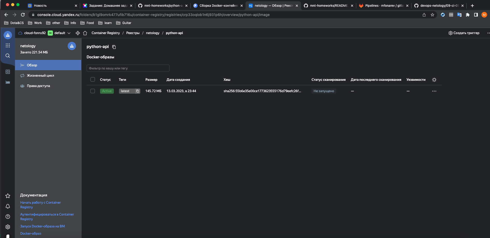

Успешный pipeline
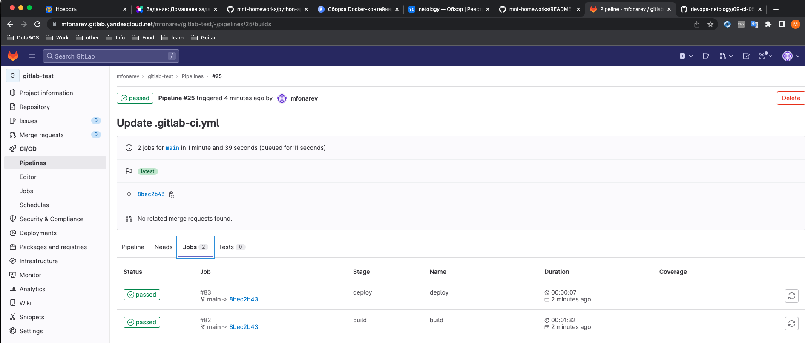

Лог очень длинный не стал выкладывать raw

## Product Owner

Issue
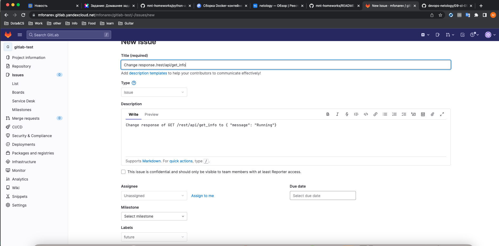

## Developer

Новая ветка
!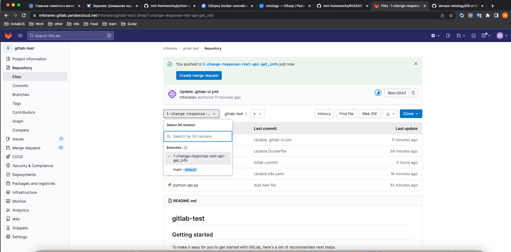

Измененный python
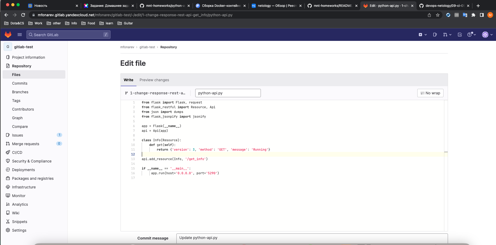

Merge
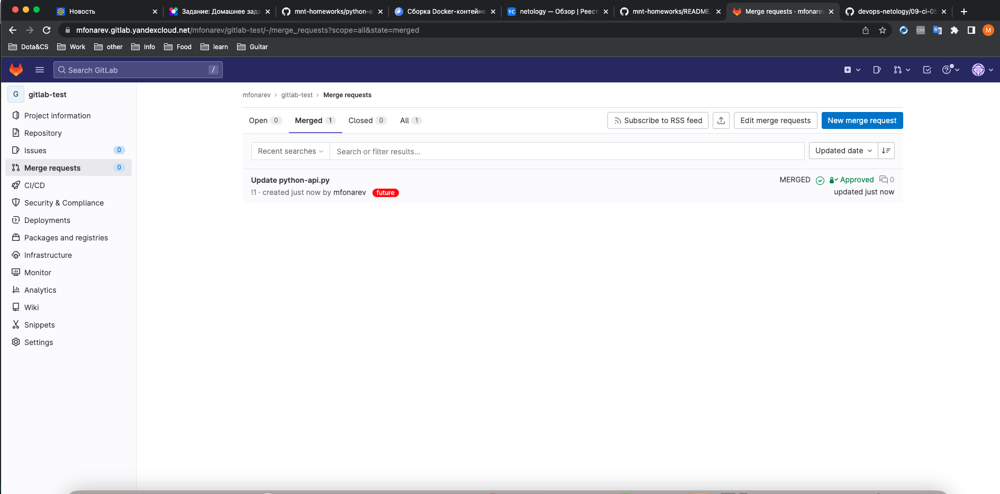

## Tester

Запущенный докер контейнер и проверка ответа Running
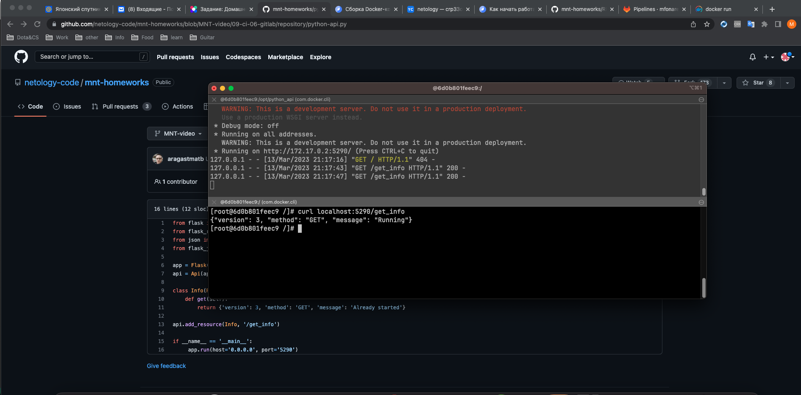

Закрытый issue
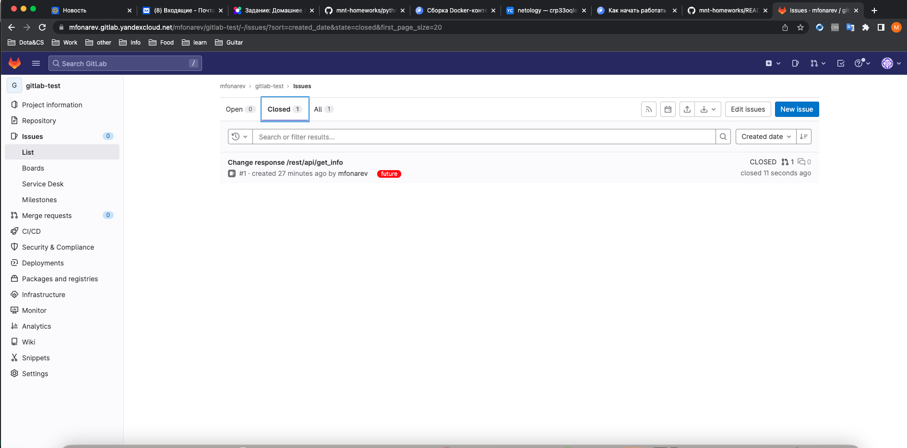