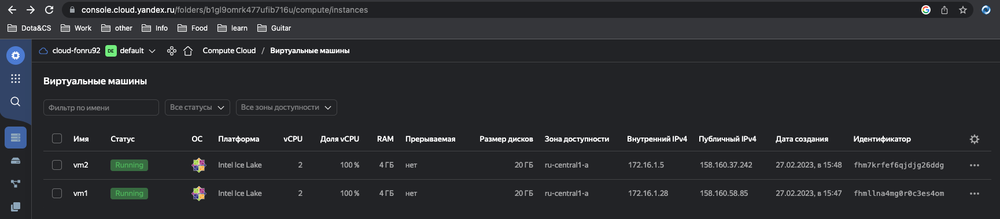
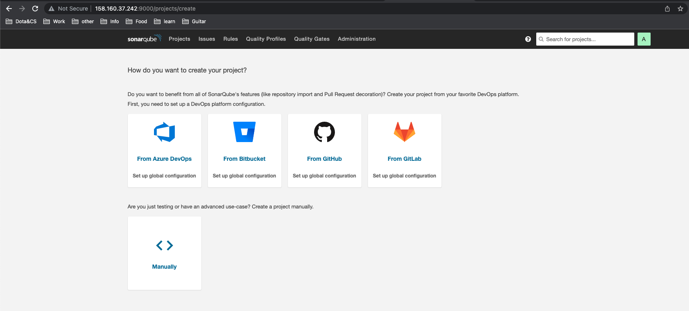
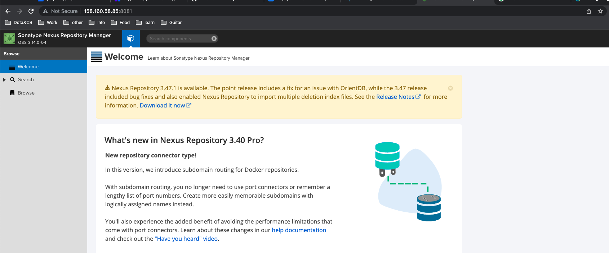
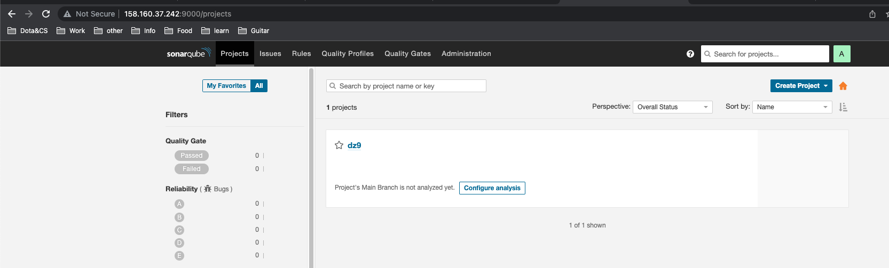
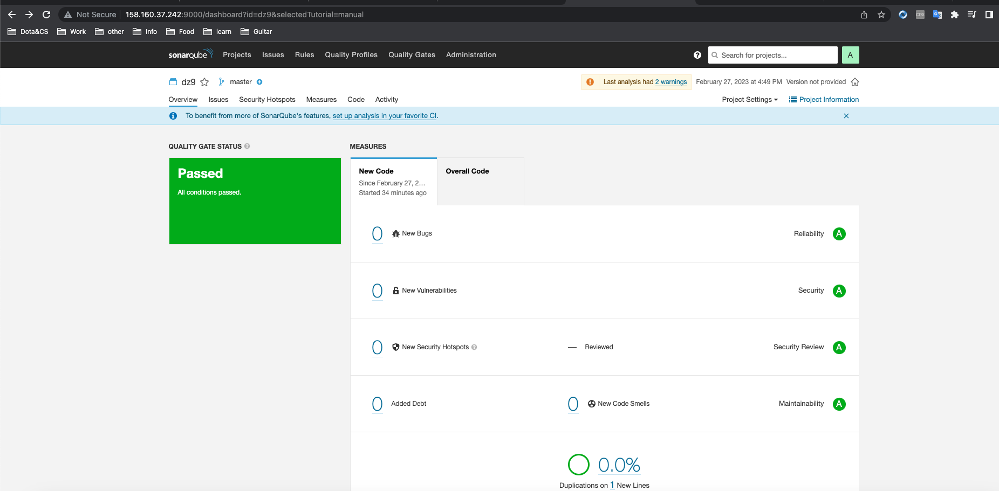
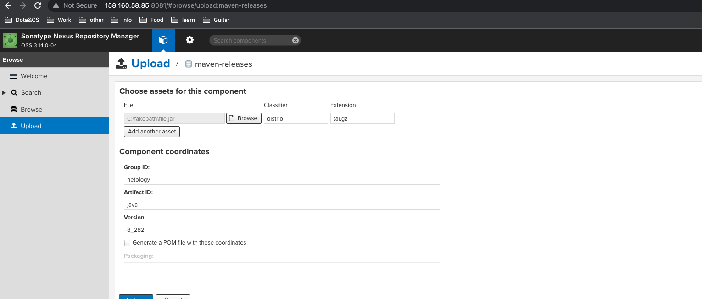
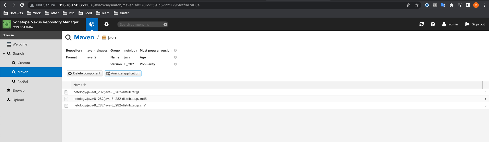
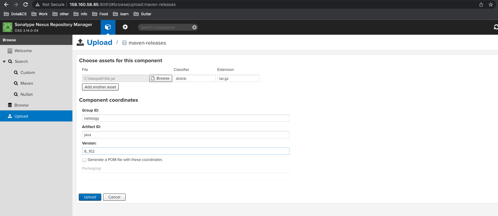

# Подготовка к выполнению

Yandex-cloud


Sonar


Nexus


# Знакомоство с SonarQube

## Основная часть

1. Создайте новый проект, название произвольное.


2,3,4 Sonarscaner
```sh
fon@fons-Mac-mini ~ % sonar-scanner --version
INFO: Scanner configuration file: /Volumes/Sklad/Download/sonar-scanner-4.8.0.2856-macosx/conf/sonar-scanner.properties
INFO: Project root configuration file: NONE
INFO: SonarScanner 4.8.0.2856
INFO: Java 11.0.17 Eclipse Adoptium (64-bit)
INFO: Mac OS X 13.2.1 x86_64
```

5,6 Вывод запуска сканера и скриншот GUI

Вывод запуска сканера
```sh
fon@fons-Mac-mini example % sonar-scanner \
  -Dsonar.projectKey=dz9 \
  -Dsonar.sources=. \
  -Dsonar.host.url=http://158.160.37.242:9000 \
  -Dsonar.login=5ee65aa7657d19b052bd2383c52bad9d5ca91e1c \
> -Dsonar.coverage.exclusions=fail.py
INFO: Scanner configuration file: /Volumes/Sklad/Download/sonar-scanner-4.8.0.2856-macosx/conf/sonar-scanner.properties
INFO: Project root configuration file: NONE
INFO: SonarScanner 4.8.0.2856
INFO: Java 11.0.17 Eclipse Adoptium (64-bit)
INFO: Mac OS X 13.2.1 x86_64
INFO: User cache: /Users/fon/.sonar/cache
INFO: Analyzing on SonarQube server 9.1.0
INFO: Default locale: "en_US", source code encoding: "UTF-8" (analysis is platform dependent)
INFO: Load global settings
INFO: Load global settings (done) | time=93ms
INFO: Server id: 9CFC3560-AYaS_KKHt0N-lZrZYb_Q
INFO: User cache: /Users/fon/.sonar/cache
INFO: Load/download plugins
INFO: Load plugins index
INFO: Load plugins index (done) | time=42ms
INFO: Load/download plugins (done) | time=4650ms
INFO: Process project properties
INFO: Process project properties (done) | time=5ms
INFO: Execute project builders
INFO: Execute project builders (done) | time=1ms
INFO: Project key: dz9
INFO: Base dir: /Volumes/Sklad/GitHub/devops-netology/CI/dz9/example
INFO: Working dir: /Volumes/Sklad/GitHub/devops-netology/CI/dz9/example/.scannerwork
INFO: Load project settings for component key: 'dz9'
INFO: Load project settings for component key: 'dz9' (done) | time=49ms
INFO: Load quality profiles
INFO: Load quality profiles (done) | time=81ms
INFO: Load active rules
INFO: Load active rules (done) | time=2272ms
INFO: Indexing files...
INFO: Project configuration:
INFO:   Excluded sources for coverage: fail.py
INFO: 1 file indexed
INFO: 0 files ignored because of scm ignore settings
INFO: Quality profile for py: Sonar way
INFO: ------------- Run sensors on module dz9
INFO: Load metrics repository
INFO: Load metrics repository (done) | time=24ms
INFO: Sensor Python Sensor [python]
WARN: Your code is analyzed as compatible with python 2 and 3 by default. This will prevent the detection of issues specific to python 2 or python 3. You can get a more precise analysis by setting a python version in your configuration via the parameter "sonar.python.version"
INFO: Starting global symbols computation
INFO: 1 source file to be analyzed
INFO: Load project repositories
INFO: Load project repositories (done) | time=27ms
INFO: 1/1 source file has been analyzed
INFO: Starting rules execution
INFO: 1 source file to be analyzed
INFO: 1/1 source file has been analyzed
INFO: Sensor Python Sensor [python] (done) | time=432ms
INFO: Sensor Cobertura Sensor for Python coverage [python]
INFO: Sensor Cobertura Sensor for Python coverage [python] (done) | time=6ms
INFO: Sensor PythonXUnitSensor [python]
INFO: Sensor PythonXUnitSensor [python] (done) | time=1ms
INFO: Sensor CSS Rules [cssfamily]
INFO: No CSS, PHP, HTML or VueJS files are found in the project. CSS analysis is skipped.
INFO: Sensor CSS Rules [cssfamily] (done) | time=0ms
INFO: Sensor JaCoCo XML Report Importer [jacoco]
INFO: 'sonar.coverage.jacoco.xmlReportPaths' is not defined. Using default locations: target/site/jacoco/jacoco.xml,target/site/jacoco-it/jacoco.xml,build/reports/jacoco/test/jacocoTestReport.xml
INFO: No report imported, no coverage information will be imported by JaCoCo XML Report Importer
INFO: Sensor JaCoCo XML Report Importer [jacoco] (done) | time=2ms
INFO: Sensor C# Project Type Information [csharp]
INFO: Sensor C# Project Type Information [csharp] (done) | time=0ms
INFO: Sensor C# Analysis Log [csharp]
INFO: Sensor C# Analysis Log [csharp] (done) | time=10ms
INFO: Sensor C# Properties [csharp]
INFO: Sensor C# Properties [csharp] (done) | time=0ms
INFO: Sensor JavaXmlSensor [java]
INFO: Sensor JavaXmlSensor [java] (done) | time=1ms
INFO: Sensor HTML [web]
INFO: Sensor HTML [web] (done) | time=2ms
INFO: Sensor VB.NET Project Type Information [vbnet]
INFO: Sensor VB.NET Project Type Information [vbnet] (done) | time=1ms
INFO: Sensor VB.NET Analysis Log [vbnet]
INFO: Sensor VB.NET Analysis Log [vbnet] (done) | time=12ms
INFO: Sensor VB.NET Properties [vbnet]
INFO: Sensor VB.NET Properties [vbnet] (done) | time=0ms
INFO: ------------- Run sensors on project
INFO: Sensor Zero Coverage Sensor
INFO: Sensor Zero Coverage Sensor (done) | time=0ms
INFO: SCM Publisher SCM provider for this project is: git
INFO: SCM Publisher 1 source file to be analyzed
INFO: SCM Publisher 0/1 source files have been analyzed (done) | time=56ms
WARN: Missing blame information for the following files:
WARN:   * fail.py
WARN: This may lead to missing/broken features in SonarQube
INFO: CPD Executor Calculating CPD for 1 file
INFO: CPD Executor CPD calculation finished (done) | time=4ms
INFO: Analysis report generated in 45ms, dir size=103.2 kB
INFO: Analysis report compressed in 7ms, zip size=14.3 kB
INFO: Analysis report uploaded in 49ms
INFO: ANALYSIS SUCCESSFUL, you can browse http://158.160.37.242:9000/dashboard?id=dz9
INFO: Note that you will be able to access the updated dashboard once the server has processed the submitted analysis report
INFO: More about the report processing at http://158.160.37.242:9000/api/ce/task?id=AYaTImSdt0N-lZrZYhEX
INFO: Analysis total time: 4.320 s
INFO: ------------------------------------------------------------------------
INFO: EXECUTION SUCCESS
INFO: ------------------------------------------------------------------------
INFO: Total time: 11.223s
INFO: Final Memory: 8M/34M
INFO: ------------------------------------------------------------------------
```


7,8,9 Скриншот sonar после исправление в fail.py



# Знакомство с Nexus

## Основная часть

1. В репозиторий maven-public загрузите артефакт с GAV-параметрами




2.3 Повторная загрузка с другой версией



4. В ответе пришлите файл maven-metadata.xml для этого артефекта.

[XML](dz9/maven-metadata.xml)

# Знакомство с Maven

## Подготовительная часть 

mvn --versiov

```shell
fon@fons-Mac-mini bin % mvn --version
Apache Maven 3.9.0 (9b58d2bad23a66be161c4664ef21ce219c2c8584)
Maven home: /Volumes/Sklad/GitHub/devops-netology/CI/dz9/apache-maven-3.9.0
Java version: 1.8.0_361, vendor: Oracle Corporation, runtime: /Library/Internet Plug-Ins/JavaAppletPlugin.plugin/Contents/Home
Default locale: en_US, platform encoding: UTF-8
OS name: "mac os x", version: "13.2.1", arch: "x86_64", family: "mac"
```

## Основная часть

1.2.3.4 В ответе пришлите исправленный файл pom.xml

[pom.xml](dz9/mvn/pom.xml)