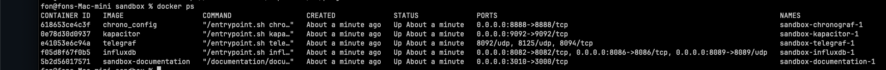
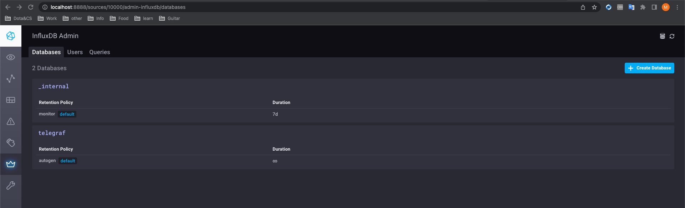
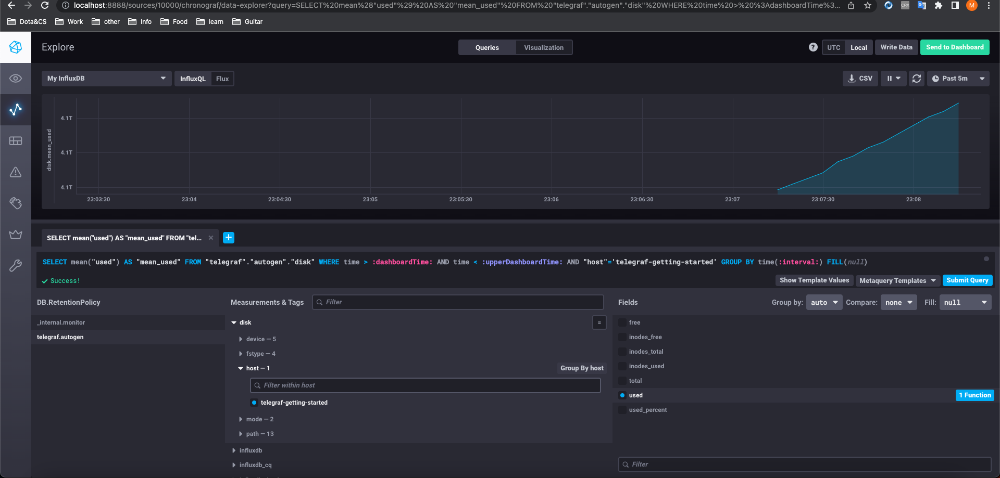
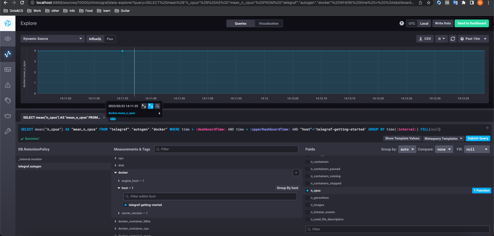

# Обязательные задания

> 1. Вас пригласили настроить мониторинг на проект. На онбординге вам рассказали, что проект представляет из себя платформу для вычислений с выдачей текстовых отчетов, которые сохраняются на диск. Взаимодействие с платформой осуществляется по протоколу http. Также вам отметили, что вычисления загружают ЦПУ. Какой минимальный набор метрик вы выведите в мониторинг и почему?

Думаю что минимально необходимо мониторить:
- CPU usage
- Количество 2xx/3xx/4xx/5xx ответов http
- Свободное кол-во пространство HDD/SSD
- Загрузка RAM хоста
- Состояние serivice нашего проекта

---

> 2. Менеджер продукта посмотрев на ваши метрики сказал, что ему непонятно что такое RAM/inodes/CPUla. Также он сказал, что хочет понимать, насколько мы выполняем свои обязанности перед клиентами и какое качество обслуживания. Что вы можете ему предложить?

А менеджеру эти метрики вообще не нужны. Менеджеру главное чтоб выполнялись SLA и показатели SLI/SLO были в оговоренных пределах. Для этого надо произвести расчет эталлоных показателей этих индикаторов.

---

> 3. Вашей DevOps команде в этом году не выделили финансирование на построение системы сбора логов. Разработчики в свою очередь хотят видеть все ошибки, которые выдают их приложения. Какое решение вы можете предпринять в этой ситуации, чтобы разработчики получали ошибки приложения?

OpenSource стэк Prometheus + Grafana мне кажется способен решить данную проблему. + Это решение бесплатное.

---

> 4. Вы, как опытный SRE, сделали мониторинг, куда вывели отображения выполнения SLA=99% по http кодам ответов. Вычисляете этот параметр по следующей формуле: summ_2xx_requests/summ_all_requests. Данный параметр не поднимается выше 70%, но при этом в вашей системе нет кодов ответа 5xx и 4xx. Где у вас ошибка?

Наверно надо отслеживать по формуле summ_2xx_responce/summ_all_requests? Сумма 2хх ответов к сумме всех запросов...

---

> 5. Опишите основные плюсы и минусы pull и push систем мониторинга.

- Модель Pull более проста с точки зрения мониторинга состояния живучести) Если приложение не отправляет в модели Push никаких метрик, проблему сложнее диагностировать. Это может быть проблема на уровне сети/приложения или же вовсе приложение переехало на другой хост.

- Push модель накладывает доп нагрузку на хост, а в pull нагрузка вся идет восновном на серверную часть.

- Pull модель невсегда способна эффективно мониторить некоторые показатели. Например при мониторинге сетевого оборудования методом pull невозможно отследить проблемы связанные с перезагрузкой системы если период pull слишком большой или же изменение в таблица маршртузации динамисеских протоколов. Push модель решает эту проблему.

---

> 6. Какие из ниже перечисленных систем относятся к push модели, а какие к pull? А может есть гибридные?

- Prometheus - pull..хотя вроде и push умеет
- TICK - push 
- Zabbix - гибрид
- VictoriaMetrics - вроде тоже pull \ push умеет
- Nagios - гибрид

---

> 7. Склонируйте себе репозиторий и запустите TICK-стэк, используя технологии docker и docker-compose.

Запустил стэк как написано в readme в указанном репозиторий

Скрин docker ps 


Скрин хронографа с подключенной базой


Выводы curl команд, но некоторые ничего не отдают...Хотя как видно из скриншота выше, все контейнеры запущены)
```shell
fon@fons-Mac-mini sandbox % curl http://localhost:8086/ping
fon@fons-Mac-mini sandbox % curl http://localhost:8888
<!DOCTYPE html><html><head><link rel="stylesheet" href="/index.c708214f.css"><meta http-equiv="Content-type" content="text/html; charset=utf-8"><title>Chronograf</title><link rel="icon shortcut" href="/favicon.70d63073.ico"></head><body> <div id="react-root" data-basepath=""></div> <script type="module" src="/index.c5ba09e6.js"></script><script src="/index.59cbcbd2.js" nomodule="" defer></script> </body></html>%
fon@fons-Mac-mini sandbox % curl http://localhost:9092/kapacitor/v1/ping
```

---

>8. Для выполнения задания приведите скриншот с отображением метрик утилизации места на диске (disk->host->telegraf_container_id) из веб-интерфейса.



---

>9. Изучите список telegraf inputs. Добавьте в конфигурацию telegraf следующий плагин - docker:

