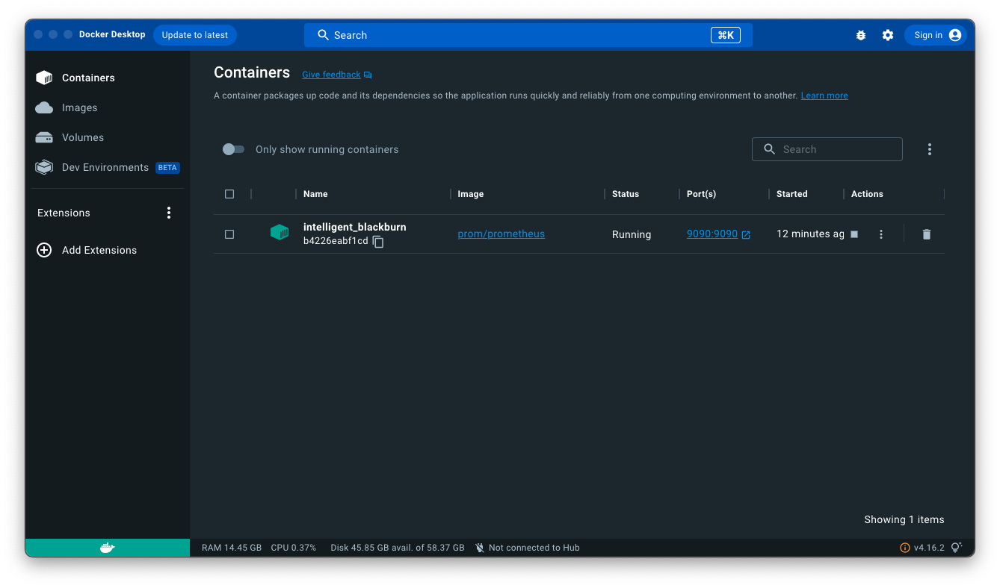
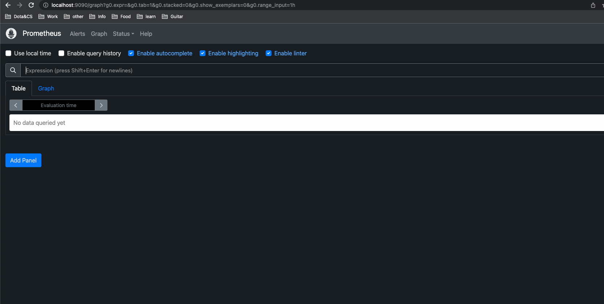
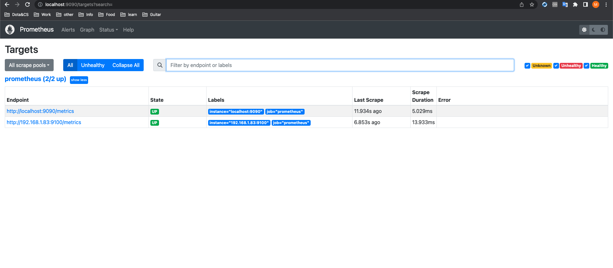
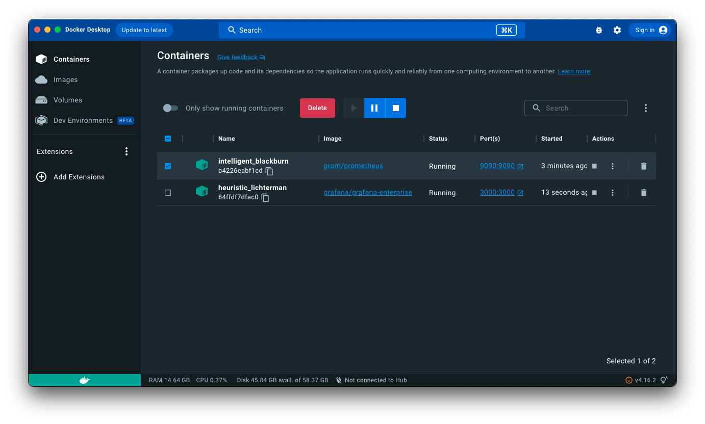
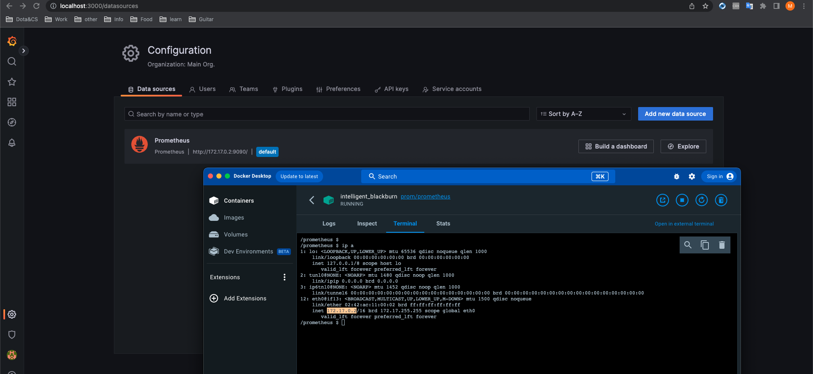
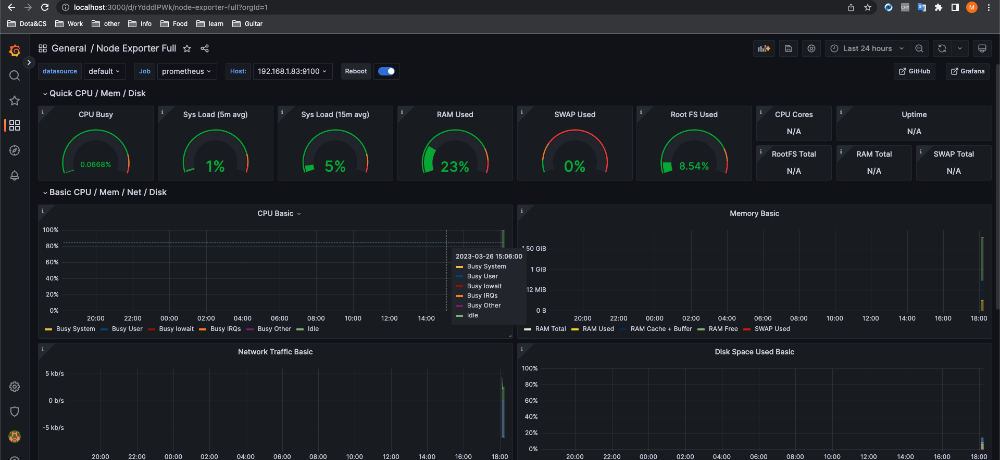
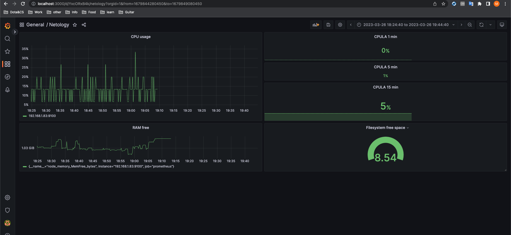
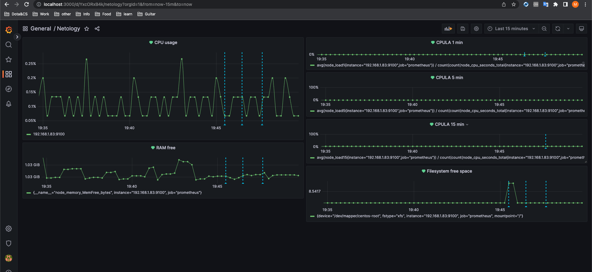

# Обязательные задания

Решил сам развернуть grafana + prometheus-server + prometheus node-exporter

prometheus-server в докер контейнере




node-exporter развернул на виртуалке Centos7

часть конфиг подключенного к prometheus node-exporter:

```sh
# The job name is added as a label `job=<job_name>` to any timeseries scraped from this config.
  - job_name: "prometheus"

    # metrics_path defaults to '/metrics'
    # scheme defaults to 'http'.

    static_configs:
      - targets: ["localhost:9090","192.168.1.83:9100"]
```

Подключенный node-exporter


Запущенный контейнер с графаной


Подключенный prometheus к grafana


Дашборд nodeexporter


# Задание 1

> Решение домашнего задания — скриншот веб-интерфейса grafana со списком подключенных Datasource.
> 
Собственно выше все скрины собранного стэка.

---

# Задание 2

> Для решения этого задания приведите promql-запросы для выдачи этих метрик, а также скриншот получившейся Dashboard.

Запросы:
- утилизация CPU для nodeexporter (в процентах, 100-idle);
  
```
(sum by(instance) (irate(node_cpu_seconds_total{instance="192.168.1.83:9100",job="prometheus", mode!="idle"}[1m])) / on(instance) group_left sum by (instance)((irate(node_cpu_seconds_total{instance="192.168.1.83:9100",job="prometheus"}[1m]))))
```


- CPULA 1/5/15 (меняется только node_load)

```
avg(node_load5{instance="192.168.1.83:9100",job="prometheus"}) /  count(count(node_cpu_seconds_total{instance="192.168.1.83:9100",job="prometheus"}) by (cpu)) * 100
```

- количество свободной оперативной памяти

```
(node_memory_MemFree_bytes{instance="192.168.1.83:9100",job="prometheus"})
```

- количество места на файловой системе

```
100 - (100 * ((node_filesystem_avail_bytes{instance="192.168.1.83:9100",mountpoint="/",fstype!="rootfs"} )  / (node_filesystem_size_bytes{instance="192.168.1.83:9100", mountpoint="/",fstype!="rootfs"}) ))
```

Дашборды


# Задание 3

Дашборды с алертами. Пришлось поменять вид некоторых дашбордов.




# Задание 4

Файл json model

[JSON-MODEL](Monitoring/json_model_dz2.json)