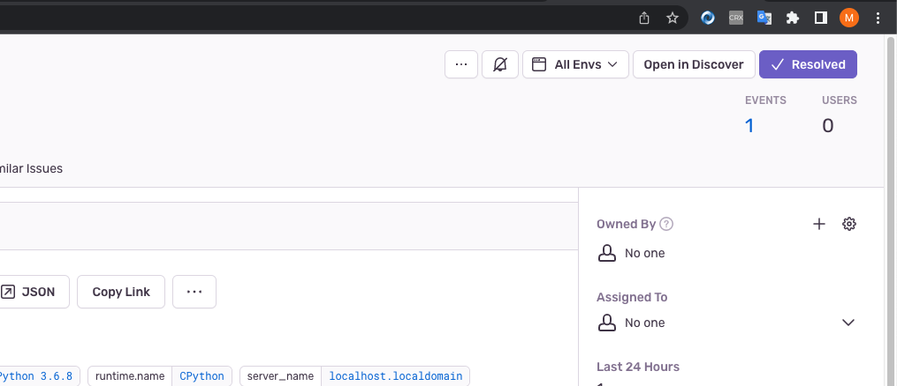

# Задание 1

> В качестве решения задания пришлите скриншот меню Projects.

---

# Задание 2

> 1. Создайте python-проект и нажмите Generate sample event для генерации тестового события.

Сделал тестовый python скрипт c делением на ноль. Скриншот прилетевшей ошибки.

> 2. Изучите информацию, представленную в событии.

> 3. Перейдите в список событий проекта, выберите созданное вами и нажмите Resolved.

> 4. В качестве решения задание предоставьте скриншот Stack trace из этого события и список событий проекта после нажатия Resolved.

Скриншоты

---

# Задание 3

> 1-2 Перейдите в создание правил алёртинга.

> Выберите проект и создайте дефолтное правило алёртинга без настройки полей.

> 3-6 Тестируем алертинг

Скриншот из почты
