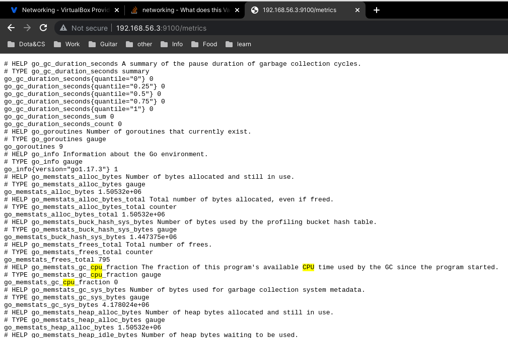

1. - С помощью комманды "wget https://github.com/prometheus/node_exporter/releases/download/v1.3.1/node_exporter-1.3.1.linux-amd64.tar.gz"
выгрузил с репозитория архив с node_exporter.
    - Далее разархивировал скаченных архив и проверил что node_exporter запускается.
    - Далее в диретории /etc/systemd/system/ создал файл node_exporter.service со следующим содержимым
```
[Unit]
Description=Node_exporter
After=network.target

[Service]
Type=simple
ExecStart=/home/vagrant/node_exporter-1.3.1.linux-amd64
Restart=always

[Install]
WantedBy=multi-user.target
```
   - С помощью комманды systemctl enable node_exporter.service добавим в автозагрузку и запускаем его.
```
vagrant@vagrant:~/node_exporter-1.3.1.linux-amd64$ systemctl status node_exporter 
● node_exporter.service - Node_exporter
     Loaded: loaded (/etc/systemd/system/node_exporter.service; enabled; vendor preset: enabled)
     Active: active (running) since Tue 2022-08-16 08:37:46 UTC; 32s ago
   Main PID: 1961 (node_exporter)
      Tasks: 6 (limit: 4611)
     Memory: 2.6M
     CGroup: /system.slice/node_exporter.service
             └─1961 /home/vagrant/node_exporter-1.3.1.linux-amd64/node_exporter
```
- Перезагрузил мащину и убедился через systemctl enable node_exporter, что сервис запустился


----
2.  CPU:
```` 
TYPE node_cpu_seconds_total counter
node_cpu_seconds_total{cpu="0",mode="idle"} 173.98
node_cpu_seconds_total{cpu="0",mode="iowait"} 0.62
node_cpu_seconds_total{cpu="0",mode="irq"} 0
node_cpu_seconds_total{cpu="0",mode="nice"} 0
node_cpu_seconds_total{cpu="0",mode="softirq"} 0.15
node_cpu_seconds_total{cpu="0",mode="steal"} 0
node_cpu_seconds_total{cpu="0",mode="system"} 3.11
node_cpu_seconds_total{cpu="0",mode="user"} 1.09
node_cpu_seconds_total{cpu="1",mode="idle"} 175.3
node_cpu_seconds_total{cpu="1",mode="iowait"} 0.39
node_cpu_seconds_total{cpu="1",mode="irq"} 0
node_cpu_seconds_total{cpu="1",mode="nice"} 0
node_cpu_seconds_total{cpu="1",mode="softirq"} 0.17
node_cpu_seconds_total{cpu="1",mode="steal"} 0
node_cpu_seconds_total{cpu="1",mode="system"} 2.3
node_cpu_seconds_total{cpu="1",mode="user"} 0.93
node_cpu_seconds_total{cpu="2",mode="idle"} 175.05
node_cpu_seconds_total{cpu="2",mode="iowait"} 0.54
node_cpu_seconds_total{cpu="2",mode="irq"} 0
node_cpu_seconds_total{cpu="2",mode="nice"} 0
node_cpu_seconds_total{cpu="2",mode="softirq"} 0.1
node_cpu_seconds_total{cpu="2",mode="steal"} 0
node_cpu_seconds_total{cpu="2",mode="system"} 2.29
node_cpu_seconds_total{cpu="2",mode="user"} 0.83
node_cpu_seconds_total{cpu="3",mode="idle"} 173.66
node_cpu_seconds_total{cpu="3",mode="iowait"} 1.22
node_cpu_seconds_total{cpu="3",mode="irq"} 0
node_cpu_seconds_total{cpu="3",mode="nice"} 0
node_cpu_seconds_total{cpu="3",mode="softirq"} 0.11
node_cpu_seconds_total{cpu="3",mode="steal"} 0
node_cpu_seconds_total{cpu="3",mode="system"} 2.1
node_cpu_seconds_total{cpu="3",mode="user"} 1.48
````
MEMORY:
````
node_memory_MemAvailable_bytes 3.71456e+09
node_memory_MemTotal_bytes 4.12223488e+09
node_memory_MemFree_bytes 3.333705728e+09
````
DISK:
````
node_disk_io_time_seconds_total{device="dm-0"} 5.164
node_disk_io_time_seconds_total{device="sda"} 5.28
node_disk_write_time_seconds_total{device="dm-0"} 0.704
node_disk_write_time_seconds_total{device="sda"} 0.76
node_disk_read_time_seconds_total{device="dm-0"} 5.896
node_disk_read_time_seconds_total{device="sda"} 4.251
````
NETWORK:
````
node_network_receive_bytes_total{device="eth0"} 107677
node_network_receive_drop_total{device="eth0"} 0
node_network_receive_packets_total{device="eth0"} 884
node_network_transmit_bytes_total{device="eth0"} 106283
node_network_up{device="eth0"} 1
````
3. Установить получилось, проброс работает:

4. Да, по выводу
````
6.110711] systemd[1]: Detected virtualization oracle.
````
5. Вывод показывает максимальное число дискрипторов.
````
vagrant@vagrant:~$ sysctl -n fs.nr_open
1048576
````
Согласно докам ***The default value fs.nr_open is 1024*1024 = 1048576 defined in kernel code. Below is the snippet from source code.
***. Получаем что 1048576 это максимально допустимое значение.

6. 
````
   root@vagrant:/home/vagrant# ps aux | grep sleep
root        2286  0.0  0.0   5480   580 pts/0    S+   10:40   0:00 unshare -f --pid --mount-proc sleep 1h
root        2287  0.0  0.0   5476   580 pts/0    S+   10:40   0:00 sleep 1h
root        2352  0.0  0.0   6432   720 pts/1    S+   10:41   0:00 grep --color=auto sleep
root@vagrant:/home/vagrant# nsenter --target 2287 --pid --mount
root@vagrant:/# ps aux
USER         PID %CPU %MEM    VSZ   RSS TTY      STAT START   TIME COMMAND
root           1  0.0  0.0   5476   580 pts/0    S+   10:40   0:00 sleep 1h
root           2  0.0  0.0   7240  3948 pts/1    S    10:42   0:00 -bash
root          13  0.0  0.0   8888  3244 pts/1    R+   10:42   0:00 ps aux
````
7. Функция которая форкает саму себя и так до бесконечности, по
Судя по выводу  1929.430697] cgroup: fork rejected by pids controller in /user.slice/user-1000.slice/session-6.scope
не позволил в рамках пользовательской сессии форкнуть больше опредленного лимита процессов. Если я все правильно понимаю, 
то спомощью ulimit -u можно задать макс. число процессов.