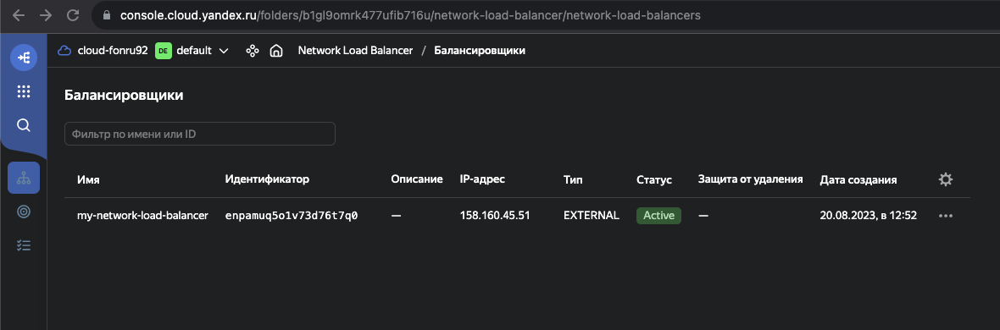
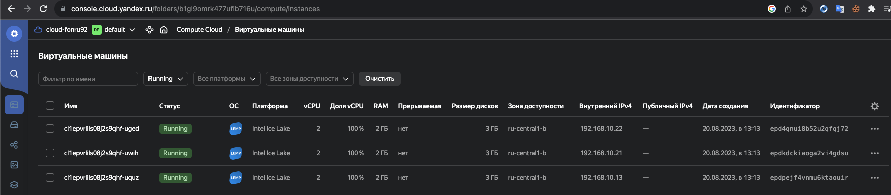
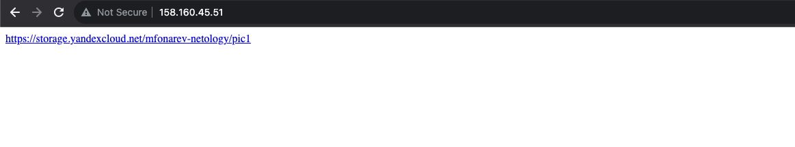
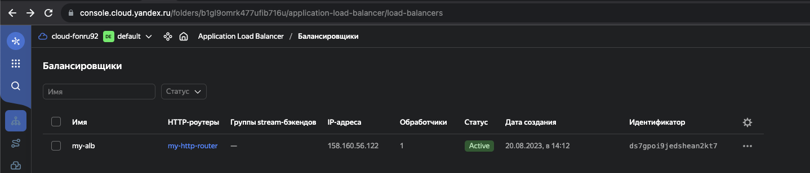
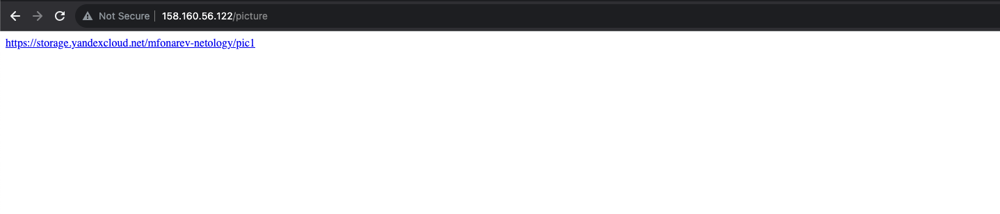

# Домашнее задание к занятию «Вычислительные мощности. Балансировщики нагрузки»  
---
## Задание 1. Yandex Cloud 

**Что нужно сделать**

1. Создать бакет Object Storage и разместить в нём файл с картинкой:

 - Создать бакет в Object Storage с произвольным именем (например, _имя_студента_дата_).
 - Положить в бакет файл с картинкой.
 - Сделать файл доступным из интернета.
 
2. Создать группу ВМ в public подсети фиксированного размера с шаблоном LAMP и веб-страницей, содержащей ссылку на картинку из бакета:

 - Создать Instance Group с тремя ВМ и шаблоном LAMP. Для LAMP рекомендуется использовать `image_id = fd827b91d99psvq5fjit`.
 - Для создания стартовой веб-страницы рекомендуется использовать раздел `user_data` в [meta_data](https://cloud.yandex.ru/docs/compute/concepts/vm-metadata).
 - Разместить в стартовой веб-странице шаблонной ВМ ссылку на картинку из бакета.
 - Настроить проверку состояния ВМ.
 
1. Подключить группу к сетевому балансировщику:
 - Создать сетевой балансировщик.
 - Проверить работоспособность, удалив одну или несколько ВМ.
4. (дополнительно)* Создать Application Load Balancer с использованием Instance group и проверкой состояния.

### Решение: 

`- Создал бакет и загрузил его следующий манифестом`

[bucket-manifest](manifests/storage.tf)

`- Создал группу ВМ + настроил health_check + через userdata передал параметры дефолтной страницы NGINX на которой разместил ссылку на картинку в бакете`

[ig-manifest](manifests/instance_gr.tf)

`- Создал через манифест target group, к которой примапил loadbalancer`

[lb-manifest](manifests/lb.tf)

`Скриншотики:`

`Далее сделал L7 балансировкщик с помощью следующего манифеста`

[alb-manifest](manifests/alb.tf)

`При запросе префикса /picture перекидывает на endpoint-ы`

