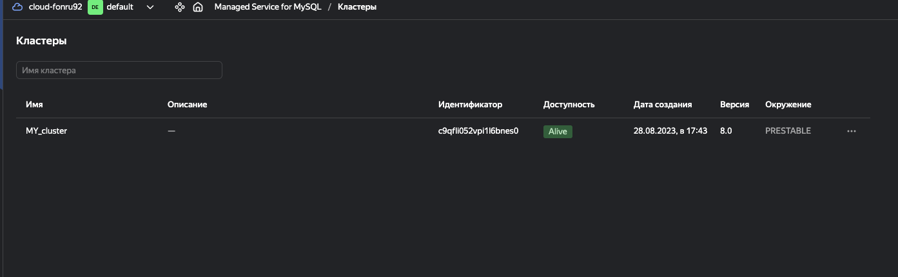
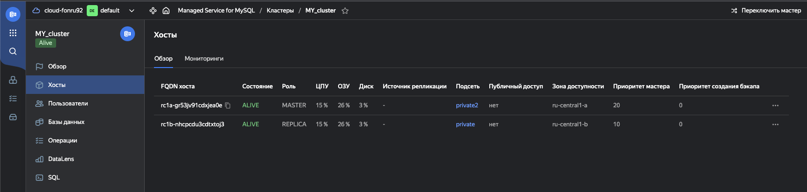
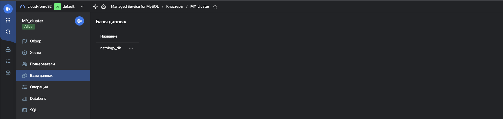
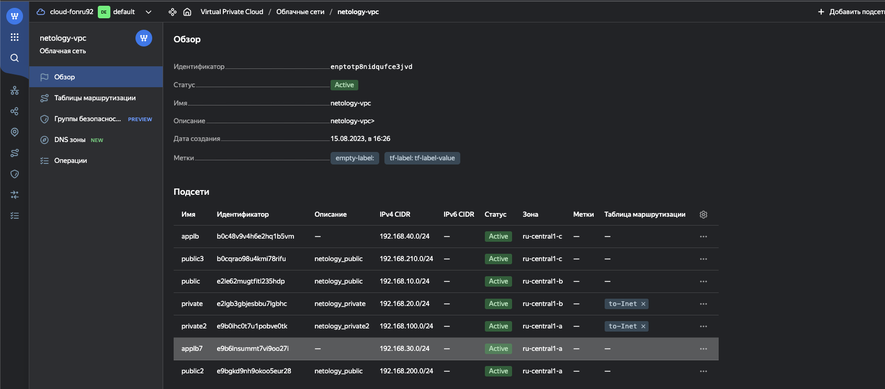
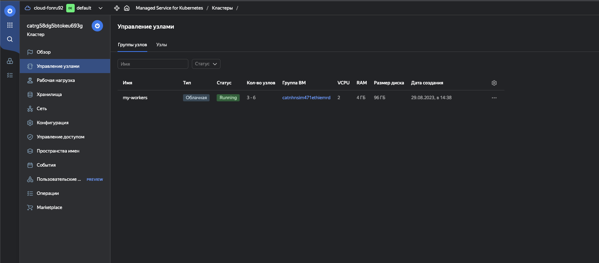
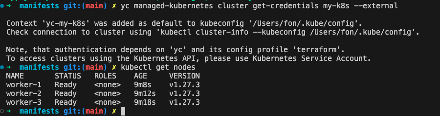
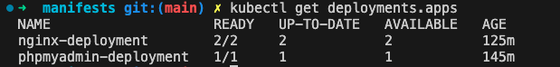

# Домашнее задание к занятию «Кластеры. Ресурсы под управлением облачных провайдеров»

### Цели задания 

1. Организация кластера Kubernetes и кластера баз данных MySQL в отказоустойчивой архитектуре.
2. Размещение в private подсетях кластера БД, а в public — кластера Kubernetes.

---
## Задание 1. Yandex Cloud

1. Настроить с помощью Terraform кластер баз данных MySQL.

 - Используя настройки VPC из предыдущих домашних заданий, добавить дополнительно подсеть private в разных зонах, чтобы обеспечить отказоустойчивость. 
 - Разместить ноды кластера MySQL в разных подсетях.
 - Необходимо предусмотреть репликацию с произвольным временем технического обслуживания.
 - Использовать окружение Prestable, платформу Intel Broadwell с производительностью 50% CPU и размером диска 20 Гб.
 - Задать время начала резервного копирования — 23:59.
 - Включить защиту кластера от непреднамеренного удаления.
 - Создать БД с именем `netology_db`, логином и паролем.

`Добавим новую подсеть private_net2 в другой зоне `

[add-new-network](manifests/main.tf)

`Далее создаем кластер согласно требованиям задания`

[db_cluster](manifests/db_cluster.tf)

2. Настроить с помощью Terraform кластер Kubernetes.

 - Используя настройки VPC из предыдущих домашних заданий, добавить дополнительно две подсети public в разных зонах, чтобы обеспечить отказоустойчивость.
 - Создать отдельный сервис-аккаунт с необходимыми правами. 
 - Создать региональный мастер Kubernetes с размещением нод в трёх разных подсетях.
 - Добавить возможность шифрования ключом из KMS, созданным в предыдущем домашнем задании.
 - Создать группу узлов, состояющую из трёх машин с автомасштабированием до шести.
 - Подключиться к кластеру с помощью `kubectl`.
 - *Запустить микросервис phpmyadmin и подключиться к ранее созданной БД.
 - *Создать сервис-типы Load Balancer и подключиться к phpmyadmin. Предоставить скриншот с публичным адресом и подключением к БД.

`Добавил в манифест две новые паблик сети public2, publi3 в разных зонах`

[add-new-network](manifests/main.tf)

`УЗ с необходимыми правами были созданы в прошлых заданиях, поэтому в k8s манифесте указал id уже созданной УЗ. Создаем k8s кластер согласно необходимым требования + добавляем worker ноды. `

[k8s](manifests/k8s.tf)

`Далее получаем конфигу командой yc managed-kubernetes cluster get-credentials my-k8s --external для подключения к кластеру и проверяем доступность`

`Далее раскатывает деплоймент phpmyadmin`

[phpmyadmin](manifests/phpmy.yaml)

