# Дипломная работа

## Ссылки
* [GITLAB - Terraform](https://mfonarev.gitlab.yandexcloud.net/diplom/terraform-diplom)
* [GITLAB - MyAPP](https://mfonarev.gitlab.yandexcloud.net/diplom/diplom-app)
* [TF - основной конфиг](./IaaC/main.tf)
* [ТF - инфраструктура сети](./IaaC/network.tf)
* [ТF - VM под k8s+infra](./IaaC/k8s_inst.tf)
* [ТF - VM под external ha-proxy](./IaaC/ext_lb.tf)
* [ТF - локали используемые в описании инфраструктуры](./IaaC/local.tf)
* [TF - секреты для docker](k8s/secret_registry.yaml)
* [Ansible - hosts kubespray](./ansible/kubespray_cfg/diplom_cluster/hosts.yaml)
* [Ansible - main playbook установка ha-proxy](./ansible/ext_lb_haproxy/main.yml)
* [Ansible - hosts ha-proxy](./ansible/ext_lb_haproxy/hosts.yml)
* [Ansible - ha-proxy.cfg](./ansible/ext_lb_haproxy/templates/ha_proxy.conf.j2)
* [Ansible - install docker](./ansible/install_docker/install.yaml)
* [APP - DOCKERFILE](https://github.com/fonru/devops-diplom/blob/main/dockerfile)
* [k8s - ingress - grafana](k8s/ingress_grafana.yaml)
* [k8s - helm runner](./gitlab_conf/runner.conf)
* [k8s - service_acc - runner](./gitlab_conf/k8s_conf.yaml)
* [k8s - my app](k8s/my_app.yaml)

## Этапы выполнения

### 1. Создание облачной инфраструктуры

Инфраструктура создана c использованием Terraform + yandex cloud provider. Ниже будут предоставлены скриншоты Yandex Cloud. В раздлеле выше указаны ссылки на все манифесты\плейбуки и т.п.

*Созданный каталог devops-diplom*

\
\
*Bucket-backend для Terraform*

\
\
*Подсети в разных зонах*


### 2. Создание Kubernetes кластера

Для создание k8s кластера использую 4 VMки (2 Master и 2 Worker). Это не по best-practise, т.к. Master нод должно быть минимум 3 в кластере. По указанной [ссылке](./diplom.md#ссылки) можно найти Terraform файл, с помощью которого создавались VM-ки.

*Созданные VMки под кластер + 1 VM под внешний балансер для доступа к k8s API*


Далее с помощью kuberspray поднял кластер предварительно сгенерив ansible-host [файл](./ansible/kubespray_cfg/diplom_cluster/hosts.yaml). Внешние ip адреса могут отличаться на скриншотах, так как машины переодически выключал для экономия баланса.


Далее для того чтоб подключаться с рабочего ПК к кластеру k8s, сделал VM под haproxy со статическим внешним ip адресом. Машинку также поднимал через Terraform ([terraform-file](./IaaC/ext_lb.tf)). Установку и настройку ha-proxy осуществлял через самописный ansible-playbook ([playbook](./ansible/ext_lb_haproxy/main.yml),[hosts](./ansible/ext_lb_haproxy/hosts.yml)).

Далее добавил внешний ip в настройки kubeadm.yaml, добавив его в SANS с помощью генерации конфига и его перезаливки

1. *Пишем kubeadm.yaml*
   
```sh
kubectl -n kube-system get configmap kubeadm-config -o jsonpath='{.data.ClusterConfiguration}' --insecure-skip-tls-verify > kubeadm.yaml
```

2. *После добавления ip делаем init фазы генерации сертификатов*
   
```sh
kubeadm init phase certs apiserver --insecure-skip-tls-verify --config kubeadm.yaml
```

3. *Загружаем конфиг*

```shell 
kubeadm init phase upload-config kubeadm --config kubeadm.yaml
```

Пункт 2 повторяем на всех мастер нодах.

По итогу после выгрузки kubeconfig и переноса его на локальную машину проверяем доступность кластера k8s.


### 3. Создание тестового приложения

В качестве приложения я решил использовать обычный nginx с доп страницей. 

[DOCKERFILE](https://github.com/fonru/devops-diplom/blob/main/dockerfile)

Для registry использовал [dockerhub](https://hub.docker.com/repository/docker/fonru/diplom/general)

*DockerHub regisry*
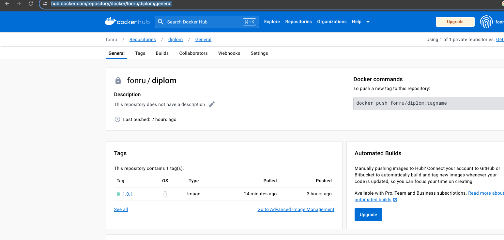

### 4. Подготовка cистемы мониторинга и деплой приложения

Использовав [kube-prometheus](https://github.com/prometheus-operator/kube-prometheus) задеплоили стэк для мониторинга (достаточно просто запустить манифест install)

Также дополнительно поставил ingress_haproxy на кластер через helm и создал [ingress](k8s/ingress_grafana.yaml) для grafana. 


Для того чтобы работали health check ingress подредактиварол разрешив доступ до графаны из других ns [network policy](diplom/k8s/grafana-networkPolicy.yaml)

Также добавил на внешний ha-proxy, использующийся для доступа к кластеру k8s, еще один backend для доступа в графану [ha-proxy.cfg](./ansible/ext_lb_haproxy/templates/ha_proxy.conf.j2)

*Состояние подов стэка мониторинга*
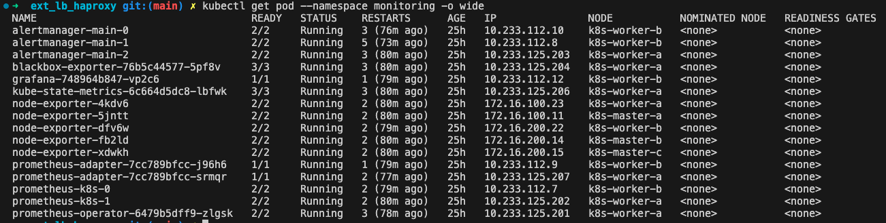

*Состояние подов haproxy ingress котролеров*
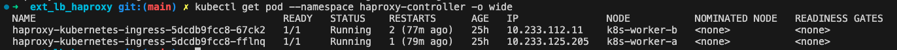

*Для доступа к графане необходимо создать запись выделенную ниже в hosts*
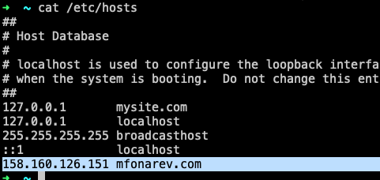

*Дашборд кластера графана*
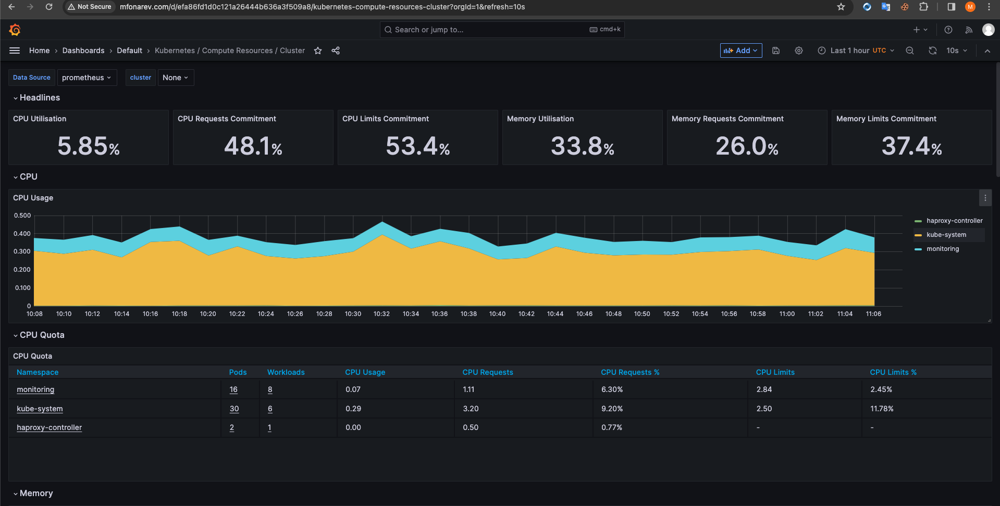

Для организации CI/CD я использовал GitLab SaaS от YC. Выходило дешевле чем не прерываемая VM.
Git-Lab runner-ы я развернул в том же кластере k8s через helm [helm-cfg](./gitlab_conf/runner.conf) в отдельном namespace gitlab-runner.

Под runner создал отдельный [service account](./gitlab_conf/k8s_conf.yaml)

*GitLab-Runner*
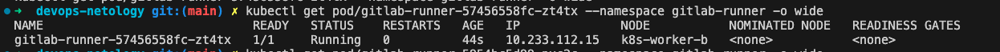

Далее в GitLab создал [новый репозиторий](https://mfonarev.gitlab.yandexcloud.net/diplom/terraform-diplom) под Terraform,
куда перенес все манифесты + создал [CI\CD](./ci/.gitlab-ci.yml).

Далее проверил CI\CD добавив новую сетку в терраформ манифест.

*Тест CI\CD Terraform*
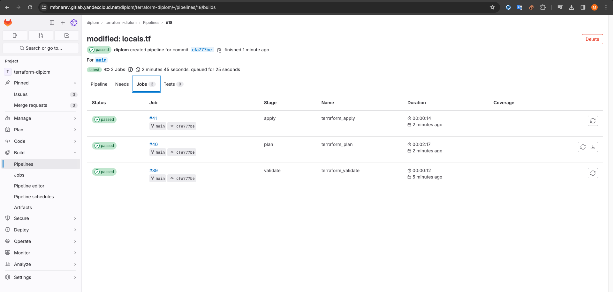

Далее через манифест добавил [секреты для docker](k8s/secret_registry.yaml)

И раскатываем приложение через [манифест](k8s/my_app.yaml)

*Раскатанная версия приложения*
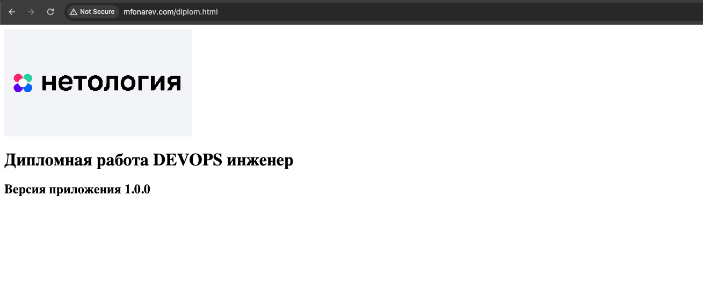


### 5 Установка и настройка CI/CD для приложения

[Репозиторий с приложением](https://mfonarev.gitlab.yandexcloud.net/diplom/diplom-app)

Настроил kubernetes agent и подключил его к своему кластеру k8s
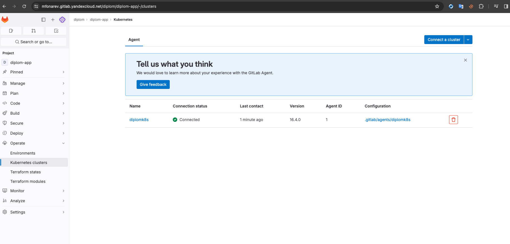

Далее через создал [ci/cd](./ci/.gitlab-ci_myapp.yml) для сборки и деплоя моего приложения, выполняющийся при пуше нового тега для коммита.

*Выполненный pipline сборки и деплоя на коммит с тегом 55.55.55*
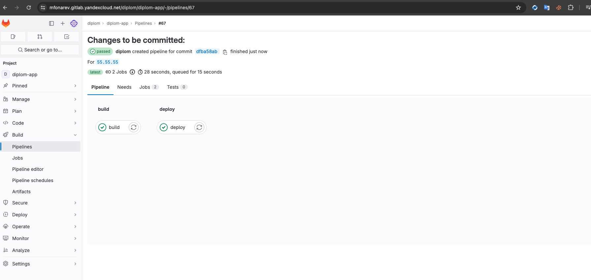

*Обновленное приложение до версии 55.55.55*
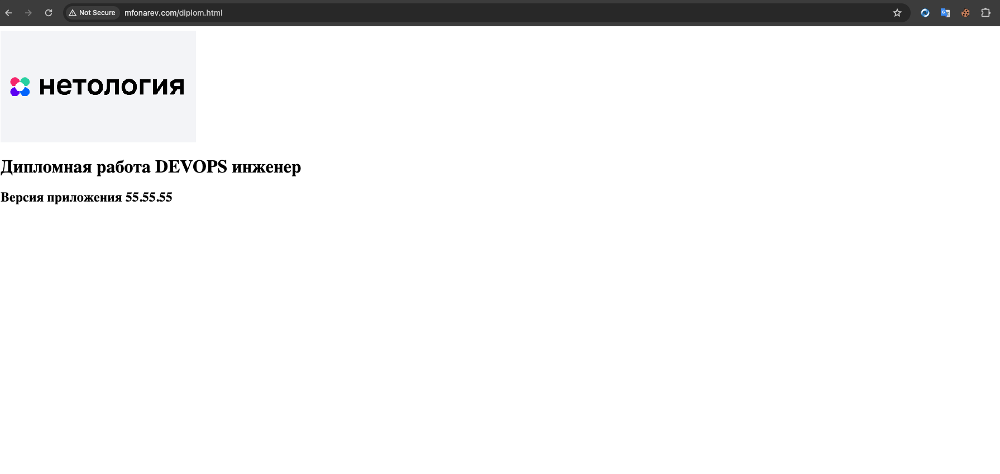

