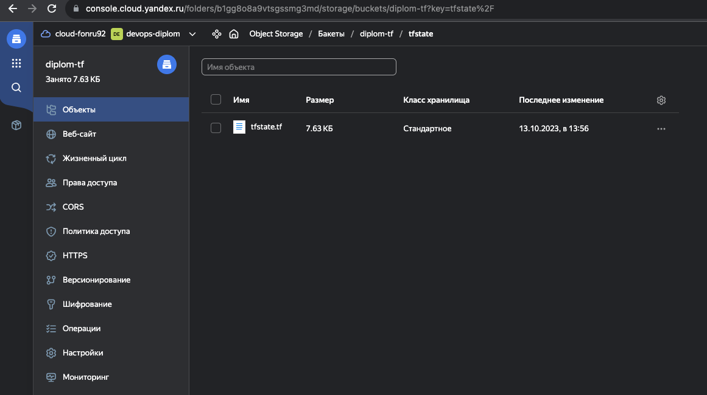
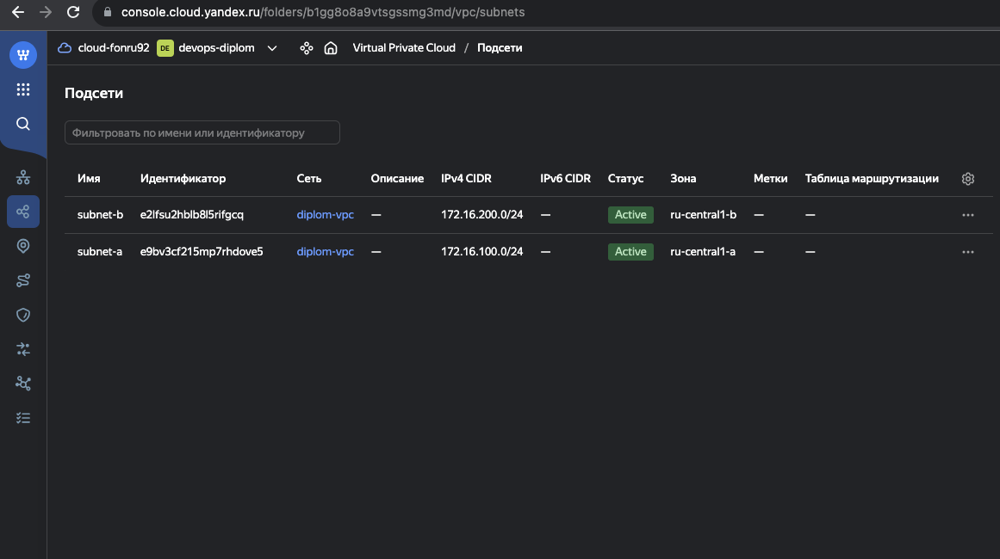

# Дипломная работа

## Ссылки

* [TF - основной конфиг](./IaaC/main.tf)
* [ТF - инфраструктура сети](./IaaC/network.tf)
* [ТF - VM под k8s](./IaaC/k8s_inst.tf)
* [ТF - VM под external ha-proxy](./IaaC/ext_lb.tf)
* [ТF - локали используемые в описании инфраструктуры](./IaaC/local.tf)
* [Ansible - hosts kubespray](./ansible/kubespray/inventory/diplom_cluster/hosts.yaml)
* [Ansible - main playbook установка ha-proxy](./ansible/ext_lb_haproxy/main.yml)
* [Ansible - hosts ha-proxy](./ansible/ext_lb_haproxy/hosts.yml)
* [Ansible - ha-proxy.cfg](./ansible/ext_lb_haproxy/templates/ha_proxy.conf.j2)
  
## Этапы выполнения

### 1. Создание облачной инфраструктуры

Инфраструктура создана c использованием Terraform + yandex cloud provider. Ниже будут предоставлены скриншоты Yandex Cloud. В раздлеле выше указаны ссылки на все манифесты\плейбуки и т.п.

*Созданный каталог devops-diplom*

\
\
*Bucket-backend для Terraform*

\
\
*Подсети в разных зонах*


### 2. Создание Kubernetes кластера

Для создание k8s кластера использую 4 VMки (2 Master и 2 Worker). Это не по best-practise, т.к. Master нод должно быть минимум 3 в кластере. По указанной [ссылке](./diplom.md#ссылки) можно найти Terraform файл, с помощью которого создавались VM-ки.

*Созданные VMки под кластер + 1 VM под внешний балансер для доступа к k8s API*


Далее с помощью kuberspray поднял кластер предварительно сгенерив ansible-host [файл](./ansible/kubespray/inventory/diplom_cluster/hosts.yaml). Внешние ip адреса могут отличаться на скриншотах, так как машины переодически выключал для экономия баланса.


Далее для того чтоб подключаться с рабочего ПК к кластеру k8s, сделал VM под haproxy со статическим внешним ip адресом. Машинку также поднимал через Terraform ([terraform-file](./IaaC/ext_lb.tf)). Установку и настройку ha-proxy осуществлял через самописный ansible-playbook ([playbook](./ansible/ext_lb_haproxy/main.yml),[hosts](./ansible/ext_lb_haproxy/hosts.yml)).

Далее добавил внешний ip в настройки kubeadm.yaml, добавив его в SANS с помощью генерации конфига и его перезаливки

1. *Пишем kubeadm.yaml*
   
```sh
kubectl -n kube-system get configmap kubeadm-config -o jsonpath='{.data.ClusterConfiguration}' --insecure-skip-tls-verify > kubeadm.yaml
```

2. *После добавления ip делаем init фазы генерации сертификатов*
   
```sh
kubeadm init phase certs apiserver --insecure-skip-tls-verify --config kubeadm.yaml
```

3. *Загружаем конфиг*

```shell 
kubeadm init phase upload-config kubeadm --config kubeadm.yaml
```

Пункт 2 повторяем на всех мастер нодах.

По итогу после выгрузки kubeconfig и переноса его на локальную машину проверяем доступность кластера k8s.

