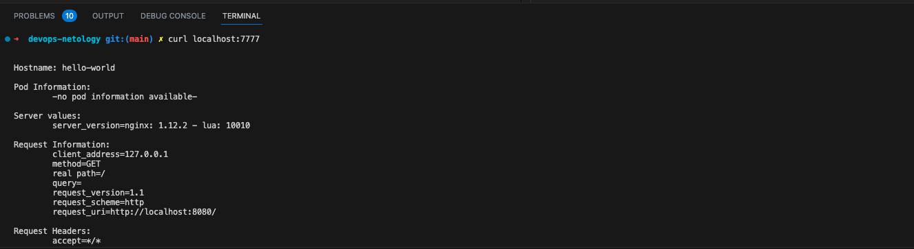
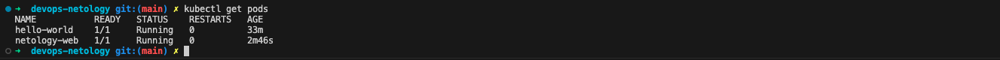
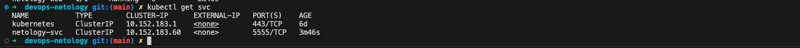

# Домашнее задание к занятию «Базовые объекты K8S»


## Задание 1. Создать Pod с именем hello-world

1. Создать манифест (yaml-конфигурацию) Pod. 
2. Использовать image - gcr.io/kubernetes-e2e-test-images/echoserver:2.

[hello-world.yml](hello-world.yml)

3. Подключиться локально к Pod с помощью kubectl port-forward и вывести значение (curl или в браузере).



## Задание 2. Создать Service и подключить его к Pod

1. Создать Pod с именем netology-web. 
2. Использовать image — gcr.io/kubernetes-e2e-test-images/echoserver:2.

[netology-web-pod.yml](netology-web-pod.yml)



3. Создать Service с именем netology-svc и подключить к netology-web.

[netology-web-svc.yml](netology-web-svc.yml)



4. Подключиться локально к Service с помощью kubectl port-forward и вывести значение (curl или в браузере)

```sh
 dz2 git:(main) ✗ kubectl port-forward  -n default svc/netology-svc 5555:5555  --address=0.0.0.0 &
[1] 16185
➜  dz2 git:(main) ✗ Forwarding from 0.0.0.0:5555 -> 8080

➜  dz2 git:(main) ✗ curl localhost:5555
Handling connection for 5555


Hostname: netology-web

Pod Information:
        -no pod information available-

Server values:
        server_version=nginx: 1.12.2 - lua: 10010

Request Information:
        client_address=127.0.0.1
        method=GET
        real path=/
        query=
        request_version=1.1
        request_scheme=http
        request_uri=http://localhost:8080/

Request Headers:
        accept=*/*  
        host=localhost:5555  
        user-agent=curl/7.88.1  

Request Body:
        -no body in request-
```