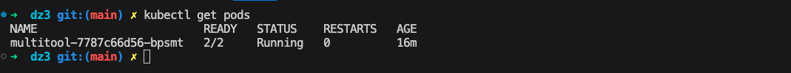
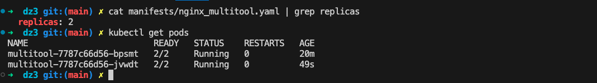
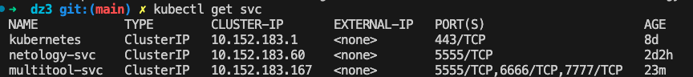
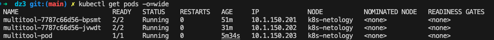
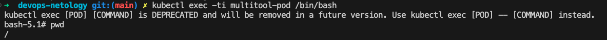
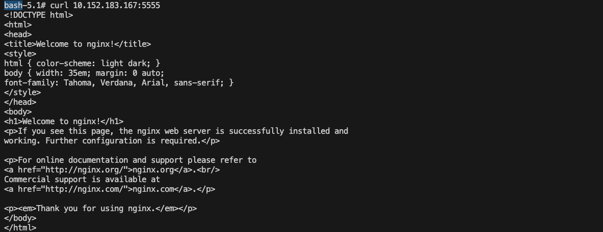
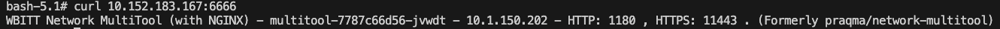
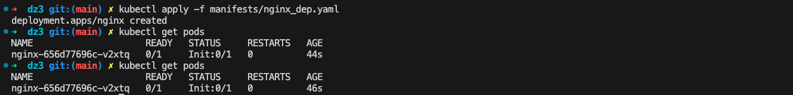
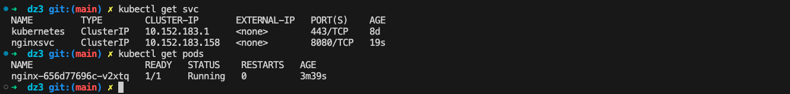

# Домашнее задание к занятию «Запуск приложений в K8S»

## Задание 1. Создать Deployment и обеспечить доступ к репликам приложения из другого Pod

1. Создать Deployment приложения, состоящего из двух контейнеров — nginx и multitool. Решить возникшую ошибку.

[файл-manifest](manifests/nginx_multitool.yaml)

2. После запуска увеличить количество реплик работающего приложения до 2.
3. Продемонстрировать количество подов до и после масштабирования.

4. Создать отдельный Pod с приложением multitool и убедиться с помощью curl, что из пода есть доступ до приложений из п.1.

\
\
\
Подключаемся к sh pod multitool-pod

\
\
\
Тестируем коннект через внутреннюю сеть до nginx

\
\
\
Тестируем коннект через внутреннюю сеть до multitool

## Задание 2. Создать Deployment и обеспечить старт основного контейнера при выполнении условий

1. Создать Deployment приложения nginx и обеспечить старт контейнера только после того, как будет запущен сервис этого приложения.
2. Убедиться, что nginx не стартует. В качестве Init-контейнера взять busybox.

[файл-manifest](manifests/nginx_dep.yaml)

3. Создать и запустить Service. Убедиться, что Init запустился.

[файл-manifest-nginxsvc](manifests/nginx_svc.yaml)

4. Продемонстрировать состояние пода до и после запуска сервиса.

