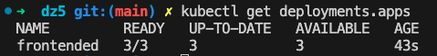
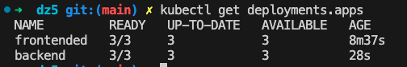
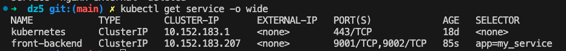
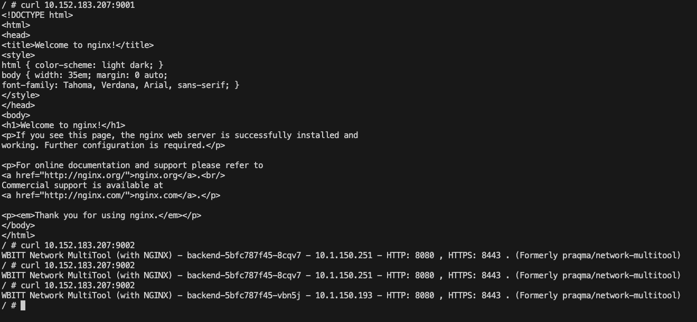
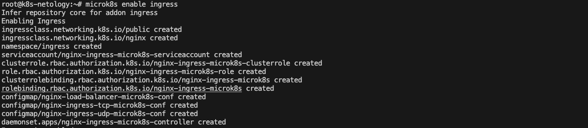
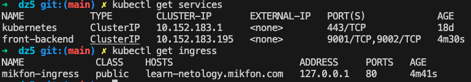
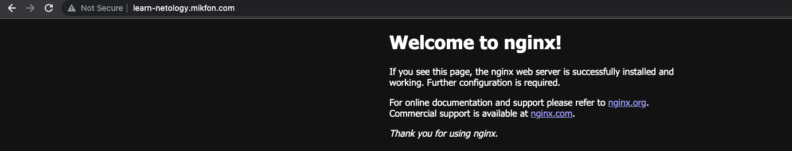
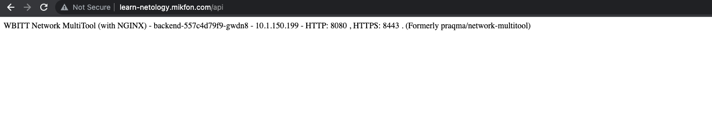

# Домашнее задание к занятию «Сетевое взаимодействие в K8S. Часть 2»

## Задание 1. Создать Deployment приложений backend и frontend

1. Создать Deployment приложения frontend из образа nginx с количеством реплик 3 шт.

[manifest](manifests/frontended.yaml)

2. Создать Deployment приложения backend из образа multitool.

[manifest](manifests/backend.yaml)

3. Добавить Service, которые обеспечат доступ к обоим приложениям внутри кластера.

[manifest](manifests/front_back_svc.yaml)

4. Продемонстрировать, что приложения видят друг друга с помощью Service.

curl с одного из подов backend

5. Предоставить манифесты Deployment и Service в решении, а также скриншоты или вывод команды п.4.

## Задание 2. Создать Ingress и обеспечить доступ к приложениям снаружи кластера

1. Включить Ingress-controller в MicroK8S.
   

2. Создать Ingress, обеспечивающий доступ снаружи по IP-адресу кластера MicroK8S так, чтобы при запросе только по адресу открывался frontend а при добавлении /api - backend.

[manifest](manifests/ingress.yaml)

3. Продемонстрировать доступ с помощью браузера или curl с локального компьютера.
   

1. Предоставить манифесты и скриншоты или вывод команды п.2.

По заданию предоставил