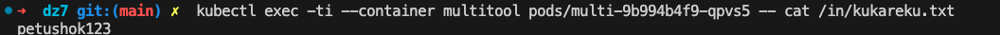

# Домашнее задание к занятию «Хранение в K8s. Часть 2»

## Задание 1

Создать Deployment приложения, использующего локальный PV, созданный вручную.

1. Создать Deployment приложения, состоящего из контейнеров busybox и multitool.
2. Создать PV и PVC для подключения папки на локальной ноде, которая будет использована в поде.

[manifest](manifests/busy-multi.yaml)

3. Продемонстрировать, что multitool может читать файл, в который busybox пишет каждые пять секунд в общей директории. 

4. Удалить Deployment и PVC. Продемонстрировать, что после этого произошло с PV. Пояснить, почему.

После удаления PVC, PV переходит в статус Released, что говорит о том, что PV высвобожден от PVC, но так как данные от предыдущего PVC все еще находятся на PV, PV будет не доступен для использования другими pod-ами пока администратор либо не вычистит PV, либо вручную удалит связку.

5. Продемонстрировать, что файл сохранился на локальном диске ноды. Удалить PV.  Продемонстрировать что произошло с файлом после удаления PV. Пояснить, почему.
   

6. Предоставить манифесты, а также скриншоты или вывод необходимых команд.

Предоставлен в пункте 2
\
## Задание 2

Создать Deployment приложения, которое может хранить файлы на NFS с динамическим созданием PV.

1. Включить и настроить NFS-сервер на MicroK8S.

- устанавливаем nfs server
  

- создаем и подключаем директории к nfs

- настраиваем /etc/exports чтоб нода microk8s могла подключать папку nfs

- проверяем что NFS поднялся 

2. Создать Deployment приложения состоящего из multitool, и подключить к нему PV, созданный автоматически на сервере NFS.

[manifest-sc](manifests/nfs_sc.yaml)

[manifest-multitool](manifests/multitool.yaml)

2. Продемонстрировать возможность чтения и записи файла изнутри пода. 

- Создаем файл внутри контейнера пода и читаем его из NFS каталога PV на ноде microk8s

- Создаем файл внутри NFS каталога PV на ноде microk8s и читаем его из контейнера пода

3. Предоставить манифесты, а также скриншоты или вывод необходимых команд.

Предоставлен в п2.