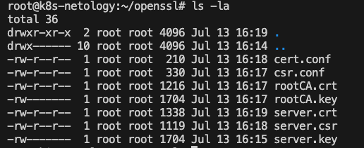

# Домашнее задание к занятию «Конфигурация приложений»

------

### Задание 1. Создать Deployment приложения и решить возникшую проблему с помощью ConfigMap. Добавить веб-страницу

1. Создать Deployment приложения, состоящего из контейнеров busybox и multitool.
2. Решить возникшую проблему с помощью ConfigMap.
3. Продемонстрировать, что pod стартовал и оба конейнера работают.

>[manifest](manifests/nginx_multitool.yaml)

>

4. Сделать простую веб-страницу и подключить её к Nginx с помощью ConfigMap. Подключить Service и показать вывод curl или в браузере.

>

5. Предоставить манифесты, а также скриншоты или вывод необходимых команд.

>Манифест в пункте 3

------

### Задание 2. Создать приложение с вашей веб-страницей, доступной по HTTPS 

1. Создать Deployment приложения, состоящего из Nginx.
2. Создать собственную веб-страницу и подключить её как ConfigMap к приложению.
   
>[manifest-ingress](manifests/ingress.yaml)

>[manifest-deploy](manifests/ingress.yaml)

3. Выпустить самоподписной сертификат SSL. Создать Secret для использования сертификата.
   
>Сгенерил сертификатики через openssl
>

4. Создать Ingress и необходимый Service, подключить к нему SSL в вид. Продемонстировать доступ к приложению по HTTPS. 

>Service и Ingress описаны в п.2

>Secrete c сертами сделал командой ниже из директории с сертами и ключами

``
kubectl create secret tls testsecret-tls --cert=server.crt --key=server.key
``
>

>Доступ через браузер, предварительно добавил корневой серт в доверенные в keychain + прописал hosts

>

5. Предоставить манифесты, а также скриншоты или вывод необходимых команд.

> Выше по заданию в отдельных пунктах
