# Домашнее задание к занятию «Управление доступом»

## Цель задания

В тестовой среде Kubernetes нужно предоставить ограниченный доступ пользователю.

------

### Задание 1. Создайте конфигурацию для подключения пользователя

1. Создайте и подпишите SSL-сертификат для подключения к кластеру.
2. Настройте конфигурационный файл kubectl для подключения.
3. Создайте роли и все необходимые настройки для пользователя.
4. Предусмотрите права пользователя. Пользователь может просматривать логи подов и их конфигурацию (`kubectl logs pod <pod_id>`, `kubectl describe pod <pod_id>`).
5. Предоставьте манифесты и скриншоты и/или вывод необходимых команд.

`Включаем RBAC`

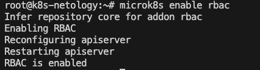

`Создали пользователя vasya и сгенерировали закрытый ключ`

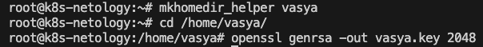

`Создаем CSR`

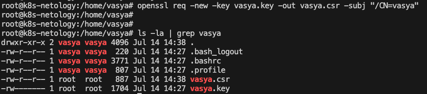

`Подписываем наш CSR используя CA key crt microk8s`

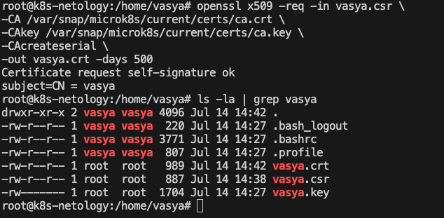

`Создали каталог .cert куда перенесли сертификат пользователя и его закрытый ключ`

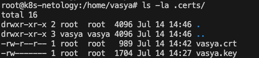

`Создаем пользователя и контекст для microk8s`

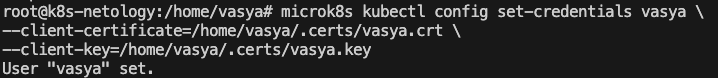

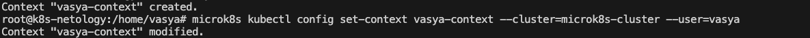

`Копируем crt и key на локальную машину`

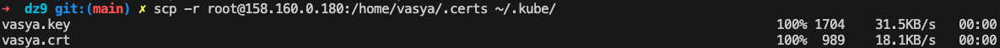

`Редактируем config к виду`

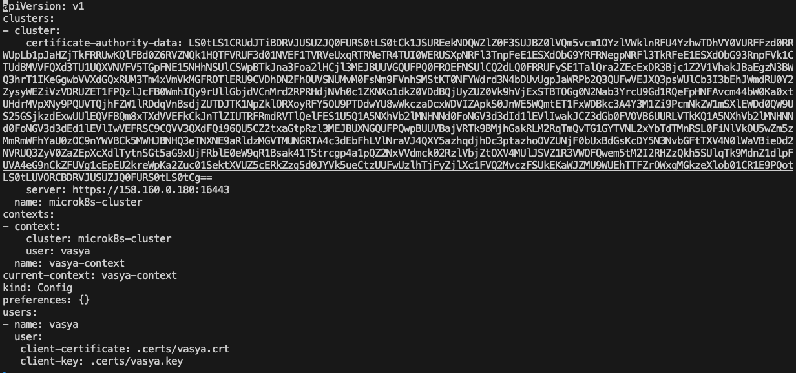

`Проверяем подключение, пока не выданы права доступа, но подключение при этом есть`

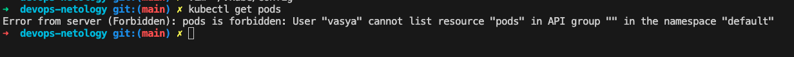

`Создаем role и role-binding для пользователя vasya c помощью команды create и yaml файла ниже`

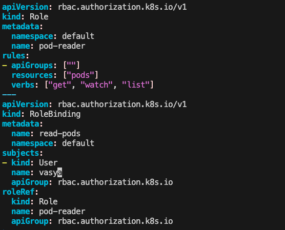

`Создаем тестовый под и проверяем что мы можем выполнять get+describe`

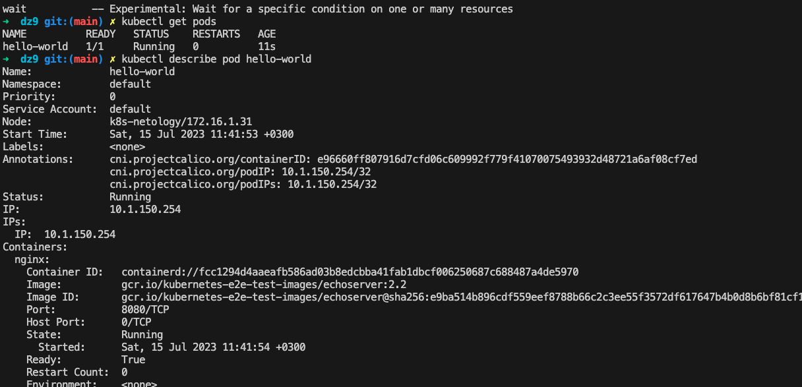

---

### Правила приёма работы

1. Домашняя работа оформляется в своём Git-репозитории в файле README.md. Выполненное домашнее задание пришлите ссылкой на .md-файл в вашем репозитории.
2. Файл README.md должен содержать скриншоты вывода необходимых команд `kubectl`, скриншоты результатов.
3. Репозиторий должен содержать тексты манифестов или ссылки на них в файле README.md.

------
