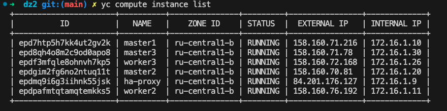
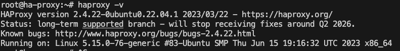
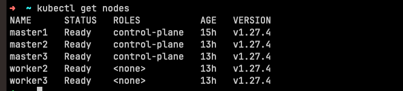
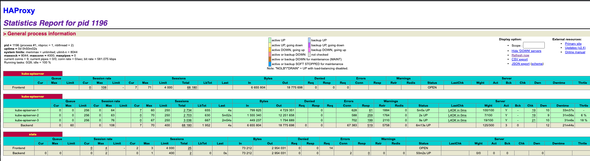

# Домашнее задание к занятию «Установка Kubernetes»

### Цель задания

Установить кластер K8s.

-----

### Задание 1. Установить кластер k8s с 1 master node

1. Подготовка работы кластера из 5 нод: 1 мастер и 4 рабочие ноды.
2. В качестве CRI — containerd.
3. Запуск etcd производить на мастере.
4. Способ установки выбрать самостоятельно.

-----

### Задание 2*. Установить HA кластер

1. Установить кластер в режиме HA.
2. Использовать нечётное количество Master-node.
3. Для cluster ip использовать keepalived или другой способ.

## Решение

Для выполнение задания 1,2 выбрал следующую конфигурацию:

* 3 master node
* 2 worker node
* 1 ha proxy



`На каждой VM для master и worker необходимо поставить rt(containerd),kubeadm,kubelet,kubectl. Для этого я решил написать небольшой ansible playbook.`

[playbook](playbook/main.yaml)

`На VM под HA-proxy установил пакет ha proxy`



`конфигурация haproxy`

```config
global
    log /dev/log  local0 warning
    chroot      /var/lib/haproxy
    pidfile     /var/run/haproxy.pid
    maxconn     4000
    user        haproxy
    group       haproxy
    daemon
   stats socket /var/lib/haproxy/stats


defaults
  log global
  option  httplog
  option  dontlognull
        timeout connect 5000
        timeout client 50000
        timeout server 50000

frontend kube-apiserver
  bind *:6443
  mode tcp
  option tcplog
  default_backend kube-apiserver

backend kube-apiserver
    mode tcp
    option tcplog
    option tcp-check
    balance roundrobin
    default-server inter 10s downinter 5s rise 2 fall 2 slowstart 60s maxconn 250 maxqueue 256 weight 100
    server kube-apiserver-1 172.16.1.10:6443
    server kube-apiserver-2 172.16.1.20:6443
    server kube-apiserver-3 172.16.1.30:6443

listen stats 
    bind :9000                          
    mode http
    stats auth haproxy-stats:password   
    stats enable                       
    stats hide-version                  
    stats realm HAProxy\ Statistics    
    stats uri /server-status           
```

`Далее на первой мастер ноде проводим иницилизацию CP node `

```shell
kubeadm init \
--apiserver-advertise-address=172.16.1.10 \
--pod-network-cidr 10.244.0.0/16 \
--apiserver-cert-extra-sans=158.160.77.189 \
--control-plane-endpoint=172.16.1.9:6443 \
--upload-certs
```

`Далее после успешной инициализации генерим ключик`

```shell
kubeadm certs certificate-key
```

`Далее подключаем master{2/3} командой`

```shell
kubeadm join 172.16.1.9:6443 --token thfvt6.mvgi7tbkibp1cff7 \
--discovery-token-ca-cert-hash sha256:4e82ed02566d708e849ffb74a905364703a04ea726caf4c173b51c43474833ec \
--control-plane \
--certificate-key af61062f72e07c30ff515fc26eb7f7f323966867711e9794d75c830246bbe566
```

`Далее подключаем worker{2/3} командой`

```shell
kubeadm join 172.16.1.9:6443 --token thfvt6.mvgi7tbkibp1cff7 \
  --discovery-token-ca-cert-hash sha256:4e82ed02566d708e849ffb74a905364703a04ea726caf4c173b51c43474833ec \
  --certificate-key af61062f72e07c30ff515fc26eb7f7f323966867711e9794d75c830246bbe566
```

`Далее переносим на локальную машину kubceconfig предварительно его сгенерив и меняем ip подключения на внешний ip HA proxy 158.160.77.189`

```shell
apiVersion: v1
clusters:
- cluster:
    certificate-authority-data: LS0tLS1CRUdJTiBDRVJUSUZJQ0FURS0tLS0tCk1JSURCVENDQWUyZ0F3SUJBZ0lJRFhTVlBxVzNIUm93RFFZSktvWklodmNOQVFFTEJRQXdGVEVUTUJFR0ExVUUKQXhNS2EzVmlaWEp1WlhSbGN6QWVGdzB5TXpBNE1ESXhPREF3TXpCYUZ3MHpNekEzTXpBeE9EQXdNekJhTUJVeApFekFSQmdOVkJBTVRDbXQxWW1WeWJtVjBaWE13Z2dFaU1BMEdDU3FHU0liM0RRRUJBUVVBQTRJQkR3QXdnZ0VLCkFvSUJBUUROVVVSK29mcGk0OFF0TUN2b2M1ZWMzWEtWVHZFbWdqaFhRMmFNdkpOMWZieVNIZS8vSHZhRzJhUkMKL1RpU2tVN3lJQytjT3BnRnE5cXNGQU4wUjE1amJxRkVBa0VwdXVUbkVQQUp6c201L211MXV1aStKRDk5dnZzQwo1bktTbE51RDdNaWxtY09Od1E4VUVZOFNmam5vZjhaL1lSMW1ZZ0xFU1B6VmtOdjFicTIzSXVkNXA3TnNZNG5pCjIxSUZvenJzRzJ2b1dLZ25La0hzb1Uyc1orNDF2eTltZGhycWlpcWhvRnpLOXZidXFSK3RmeEJSREx6THBET0IKZXFBaEM2MExnL3M1b3l1a05mOWNaallVc1BNb1JGdmNGQzV1dHhFWExORkxiV1FVemZGYXoxYUh6SlMxMUQvSApHVC9DZHhSOVJ0RHZCUEhKVzhSWmF0Tmc4dWtkQWdNQkFBR2pXVEJYTUE0R0ExVWREd0VCL3dRRUF3SUNwREFQCkJnTlZIUk1CQWY4RUJUQURBUUgvTUIwR0ExVWREZ1FXQkJSRFRjTmU2b005endvcGNzSjRyTFM1V0RNLy9EQVYKQmdOVkhSRUVEakFNZ2dwcmRXSmxjbTVsZEdWek1BMEdDU3FHU0liM0RRRUJDd1VBQTRJQkFRQXJiT0Z2aXJlcwo0QjQ5ek55REo5SHkrc3lWeEF3YWU4eVI4RWViY0hUNVFROXBISzBlM1pFampmdXpXOVJVNTcrcDlzYkNacVdlCmFHbEdDMFpHdmQ0bE8vbkthRGpXaFljV29KZmJzYmVvTmozV0lhSmRURTRZaWJjQm9hUndwODBQSDJRaUkzbEYKT1djVzIzYndKVzhDbVdJWVgvMEdHbThRaEZZMUJnWk5CbkNDU2N1TWZjRE9maTYva3d1dEVnL2JrMGNvdDZpagpJUElYd3EwMDRhTkRFa0wyT2dqaEdyUnJiQmNwa2pBVGtJTVU0UlozeGlhMklBQ3UrbkM5NXc5aWVUZjV1MGxTCjJjbkRLVElObGl3WDVEMzhhdk5QWHYyaHFEWGFQamVzeWpjY1lmbWNONXRRN052TzlGa1BueVl3NytlTzlYTzgKZ0tLVlF0bFJHWCtoCi0tLS0tRU5EIENFUlRJRklDQVRFLS0tLS0K
    server: https://158.160.77.189:6443
  name: kubernetes
contexts:
- context:
    cluster: kubernetes
    user: kubernetes-admin
  name: kubernetes-admin@kubernetes
current-context: kubernetes-admin@kubernetes
kind: Config
preferences: {}
users:
- name: kubernetes-admin
  user:
    client-certificate-data: LS0tLS1CRUdJTiBDRVJUSUZJQ0FURS0tLS0tCk1JSURJVENDQWdtZ0F3SUJBZ0lJQkllMVdEd3NSR1l3RFFZSktvWklodmNOQVFFTEJRQXdGVEVUTUJFR0ExVUUKQXhNS2EzVmlaWEp1WlhSbGN6QWVGdzB5TXpBNE1ESXhPREF3TXpCYUZ3MHlOREE0TURFeE9EQXdNekphTURReApGekFWQmdOVkJBb1REbk41YzNSbGJUcHRZWE4wWlhKek1Sa3dGd1lEVlFRREV4QnJkV0psY201bGRHVnpMV0ZrCmJXbHVNSUlCSWpBTkJna3Foa2lHOXcwQkFRRUZBQU9DQVE4QU1JSUJDZ0tDQVFFQXhlT0VaelpyNkhDS3VoM0IKZURYbDIzdy9WRjdaZkMwbisrK2lBOGx1cXhYU1cveWttV0FoZFkzWm5DbFM1RVZxN2VZVFpmS1Y0NWNTVnNqTApNWVNpaDFYN1lkYk82aVZaNzRESXZ6d3BQVTJVei9kdG5IQ0xTYzdGQ0lTRjZBK2didlJjdkxzb0pHVG5XRlVnCmFyWWtRd2E0OHNzZVQ0MTJjcGdzaTlCa2Z4M0d4WUhNMzBheVV3L0NKdmgxemhxeFlQb290T0tHZ05TUkNBYXMKTDlCRjlacWhqOHRaN1gzU2lFanpiM1VNSE84M2cxM2hDVlNvbGR2aUdkVWFSSzdsaExveU96U1FWbW9yb1YwZgpTSzlMYU9yQmZtUy9lUjF3cUZiaHRDWjNDOWYwSUtqN2tBUWdSc2l5LzRxRlovUHI3SDVJK1kwU0lkdWd2Zm15CmQ1SHMxUUlEQVFBQm8xWXdWREFPQmdOVkhROEJBZjhFQkFNQ0JhQXdFd1lEVlIwbEJBd3dDZ1lJS3dZQkJRVUgKQXdJd0RBWURWUjBUQVFIL0JBSXdBREFmQmdOVkhTTUVHREFXZ0JSRFRjTmU2b005endvcGNzSjRyTFM1V0RNLwovREFOQmdrcWhraUc5dzBCQVFzRkFBT0NBUUVBZndBcnN5WVF1OStsN2g1ZnhWMHJ1Tkc1ejdzRGYrUnRKVmQ4CmpGcCtiemk5bG9jeU5yeXdnQVMrSXd2aG9ERUJKb203NE01dzQ0SG03S1h3NHAyQUlrdWFVMHVEQmlKcnNVMXIKa1ZtZlQrNUpsR1RJV25HT2dqWTZreUlsTkNYbnVvbFRIWEhjb2JGaGxEK2hTRzVyem14V2lPbHRGRFRvd2kzQgppai9vWXNRNFFnOWl3cVdlOEc3UGlWWVV3N04wb29mKzYramVsd2JiOFRsb0Z4N0dMM1dZVVZtb3JKbStjN3JLClBOeWszQkx4dTVPT1FLUTAwOUV5QktESXp5TzVOSHRZRFZ1TmF5QXRCS1lDelJpYzNqb2srTEo0bTM0YWRSZDkKY0dkOUdKZDV0RGhaUU9lUU4xU2JlWk1ENTZpR3JGcmtwQ045OGJ6dU1ra2xaUldnVlE9PQotLS0tLUVORCBDRVJUSUZJQ0FURS0tLS0tCg==
    client-key-data: LS0tLS1CRUdJTiBSU0EgUFJJVkFURSBLRVktLS0tLQpNSUlFcFFJQkFBS0NBUUVBeGVPRVp6WnI2SENLdWgzQmVEWGwyM3cvVkY3WmZDMG4rKytpQThsdXF4WFNXL3lrCm1XQWhkWTNabkNsUzVFVnE3ZVlUWmZLVjQ1Y1NWc2pMTVlTaWgxWDdZZGJPNmlWWjc0REl2endwUFUyVXovZHQKbkhDTFNjN0ZDSVNGNkErZ2J2UmN2THNvSkdUbldGVWdhcllrUXdhNDhzc2VUNDEyY3Bnc2k5QmtmeDNHeFlITQozMGF5VXcvQ0p2aDF6aHF4WVBvb3RPS0dnTlNSQ0Fhc0w5QkY5WnFoajh0WjdYM1NpRWp6YjNVTUhPODNnMTNoCkNWU29sZHZpR2RVYVJLN2xoTG95T3pTUVZtb3JvVjBmU0s5TGFPckJmbVMvZVIxd3FGYmh0Q1ozQzlmMElLajcKa0FRZ1JzaXkvNHFGWi9QcjdINUkrWTBTSWR1Z3ZmbXlkNUhzMVFJREFRQUJBb0lCQVFERlp4RE5aUngvNHNTQQpwTzQ2WEluUFNVSmpoN3FzaE44K0V1NHJtT1V0QmJleXkzUG5ERjVVUmd5dUd3cjFhOG9mUjBSU2pvdTNYUnlPCk5mOThoak1iamtvV2I1STVRTWxXZ2NIQUF1T2dvNk92VWNPbUt4N0hvZHdyZ3dlUlZ3VlRxYkJaRk5vV2RCSFQKckJlS1crZ1FkTVJLYnhUdGh0Q0J3QXV2N1ZKUytqL2wwUWkvYWpHL0VQTUp0d05IQmVybVFlK3c5V0JtKzAxbAo3QVFubUhnNzRJY2NCeTI5aUQ0YWlkdmVDdEdkenpwTENBM3hvVUN5TVdtd2tqQmF2cHVKbGU5WXp3TS9pTENjCmtXbC9UVnY5Mkl6U1F5c0I1RUV3NGNIUXY4cWhaQmxoV21BQzlWV25Cc1pia1JtWGJWbkc5czNuYStBYS8vYTUKY29sVWMvZ0JBb0dCQU9oc0kxTVgwVXJzMWduWi9mcjRqODY0YkNrVEpSOXY5TTBTa3VFOEVXN1E1VjZwRnc1cQoyUWw1a3MvZWNSbGJzeG0vdEx2bEtyUHg4bmhrL1hJSEV4bXhtNGRPNXVqTnRHcDBFUnNNdUs4T2JkUVZzcExPCnV6dUxacWc3Z1J6TWR2ZXNqbDdIN2dQZ2hVT3lLL3l1MjM0akR3Q2Zpc2tVcStZM3JZZUF4VUhGQW9HQkFObjIKajhvSks0Z1JZZjlldTRaK3kza2FhRklpYU1ETW1XT1gvL2g4bDc3aE1rNFJJSVZpR25iNG9GK09tOEg2SHROYQo1VkhHWUNRdUxiaUVIVkxiVDJYTEtEZjF0U3d0RUluRmFSQlN6Z2V5WDFBN3BnZk9TV0tFTGMxQ2dlaTNQU3RMCjdiOWdYL0h2WExHMGg0MHpYZWdCZ2I4RjgvaVVBKzFzc3VobU5QL1JBb0dCQU5KVEdWeFdUMVZJSVNEbEhnc0EKNTlJZjNmRUZuREJvdGRUbUcvaXF6UFBGSWV1WmhIM05mdjR1QUFjUHVyVkI0RDlLMWhpNmR2eEQxREhTNGU5UQpLNTZ5dEpXcmR4WHhJSFM4OThYTXEwdnUrTUJWcWpWajB0YzlmUFo4Y29oSEZ0bG1VNmU5c012ZFgzczFQc3o0Cnh6UE1NZ1ZVV3RsQVZaYU5pQUQ1TElncEFvR0JBSjVrTDcrcEJFcGdIMi9kWHJieEkxb0JGN2hBS3hHWVhRdGoKNU82bFUveXhWOFlsYWhXajRnbDh5Y1pITXVjMnBQb0Fmczc3TXRoMytsK3hHa0lnLzBUQTZwd240UjJXTGdPQQpRc1pLOWsvZmpxWVdncVAvZzVLazdVZlJRZWhrYUg0ek1qVTFpdU9jaHliWVF2MFlTL0NTVDhBS1NtM2syaW5LCktRVDdhUjVSQW9HQWNzMXkweUdxSXZoZzRxUDF4VFRBMTVxdlNMN3NHVTdZaGdlVHhLSmkzcjRQYklsR3Vtbk8KQytDME94eWx2SFZnY3duVmZBbXZXM0YxL0Jqd3VmZlZnVTRuak1QZGppNFVvaFJlM0U5cVpYUGc0LytWQ0FTTwo2M0VIK2Z3NlJ0dElZR1JadnRBOTVBOTBLNWNRT2N2RENhVVhSa0xpUGFrVGxYS1ZRVURONWFJPQotLS0tLUVORCBSU0EgUFJJVkFURSBLRVktLS0tLQo=
```

`Проверяем что кластер доступен с локальной машины через HA proxy`




