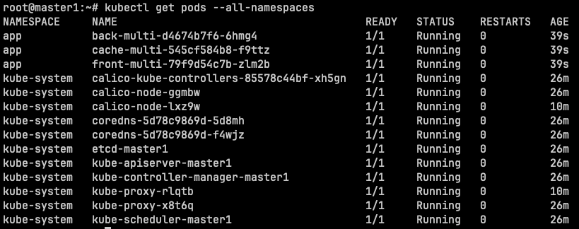
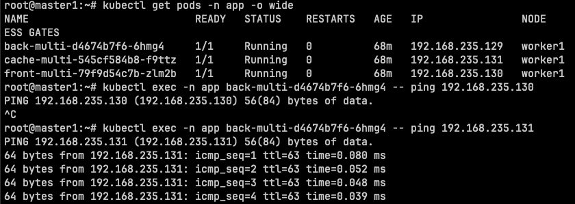
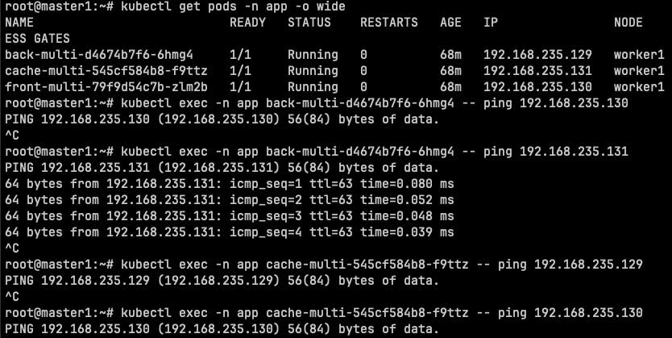

# Домашнее задание к занятию «Как работает сеть в K8s»

### Цель задания

Настроить сетевую политику доступа к подам.

### Задание 1. Создать сетевую политику или несколько политик для обеспечения доступа

1. Создать deployment'ы приложений frontend, backend и cache и соответсвующие сервисы.
2. В качестве образа использовать network-multitool.
3. Разместить поды в namespace App.
4. Создать политики, чтобы обеспечить доступ frontend -> backend -> cache. Другие виды подключений должны быть запрещены.
5. Продемонстрировать, что трафик разрешён и запрещён.

### Решение

`Установленный calico + 3 deployment multitool в NS app`

[manifest](manifests/deploy.yaml)

`Примененем сетевые политики согласно заданию frontend -> backend -> cache`
[manifest](manifests/net-policy.yaml)

`Проверяем полиси c back-->front back--->cache`

`Проверяем полиси c cache-->front cache--->back`

