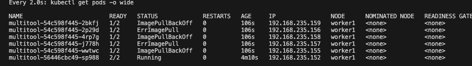
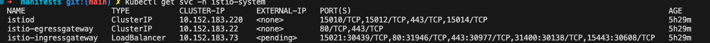

# Домашнее задание к занятию «Обновление приложений»

### Цель задания

Выбрать и настроить стратегию обновления приложения.

-----

### Задание 1. Выбрать стратегию обновления приложения и описать ваш выбор

1. Имеется приложение, состоящее из нескольких реплик, которое требуется обновить.
2. Ресурсы, выделенные для приложения, ограничены, и нет возможности их увеличить.
3. Запас по ресурсам в менее загруженный момент времени составляет 20%.
4. Обновление мажорное, новые версии приложения не умеют работать со старыми.
5. Вам нужно объяснить свой выбор стратегии обновления приложения.

`Так как ресурсы ограничены и не могут быть увеличены, то держать и старую и новую версию deployment мы не можем + приложение не работает со старой версией. Поэтому думаю стратегия Recreate единственно подходящая`

### Задание 2. Обновить приложение

1. Создать deployment приложения с контейнерами nginx и multitool. Версию nginx взять 1.19. Количество реплик — 5.
2. Обновить версию nginx в приложении до версии 1.20, сократив время обновления до минимума. Приложение должно быть доступно.
3. Попытаться обновить nginx до версии 1.28, приложение должно оставаться доступным.
4. Откатиться после неудачного обновления.

`Используя манифест делаем максимально быстрым 4 из 5 реплик обновляются, 1 всегда в UP`[manifest](manifests/nginx_multitool.yaml)

`Обновляем nginx на версию 1.20`

`Пробуем обновить до несуществующей версии 1.28. Далее возвращаемся к версии 1.20`

### Задание 3*. Создать Canary deployment

1. Создать два deployment'а приложения nginx.
2. При помощи разных ConfigMap сделать две версии приложения — веб-страницы.
3. С помощью ingress создать канареечный деплоймент, чтобы можно было часть трафика перебросить на разные версии приложения.

[nginx-manifest](manifests/nginx1.yaml)

`Создаем указанным манифестами два деплоймента с разными index.html (разные версии деплоймента) примапленные к одному сервису`

`Для решения данного задания я выбрал istio ingres controller. Процесс установки по офф доке`

[canary-istio](manifests/canary.yaml)

`Далее разворачиваем указанным выше манифестом GW,VS и DR для управлением траффиком`

`Управляя весами VS можно управлять траффиком, тем самым реализовав канареечный деплой`

`Пример траффика 90\10`
