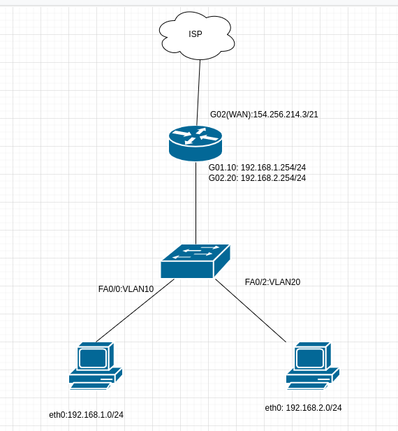

1. Удалось подключиться и посмотреть маршруты.
````
route-views>show ip route 77.238.102.211 255.255.248.0
Routing entry for 77.238.96.0/21
  Known via "bgp 6447", distance 20, metric 0
  Tag 6939, type external
  Last update from 64.71.137.241 20:27:41 ago
  Routing Descriptor Blocks:
  * 64.71.137.241, from 64.71.137.241, 20:27:41 ago
      Route metric is 0, traffic share count is 1
      AS Hops 2
      Route tag 6939
      MPLS label: none
route-views>show bgp 77.238.102.211 255.255.248.0
BGP routing table entry for 77.238.96.0/21, version 2421129251
Paths: (23 available, best #20, table default)
  Not advertised to any peer
  Refresh Epoch 1
  8283 199599
    94.142.247.3 from 94.142.247.3 (94.142.247.3)
      Origin IGP, metric 0, localpref 100, valid, external
      Community: 174:140 8283:1 8283:101 64000:40000
      unknown transitive attribute: flag 0xE0 type 0x20 length 0x18
        value 0000 205B 0000 0000 0000 0001 0000 205B
              0000 0005 0000 0001 
      path 7FE0ABD4FFA8 RPKI State not found
      rx pathid: 0, tx pathid: 0
  Refresh Epoch 1
  20130 6939 199599
    140.192.8.16 from 140.192.8.16 (140.192.8.16)
      Origin IGP, localpref 100, valid, external
      path 7FE120974A30 RPKI State not found
      rx pathid: 0, tx pathid: 0
  Refresh Epoch 1
  20912 3257 174 12389 199599
    212.66.96.126 from 212.66.96.126 (212.66.96.126)
      Origin IGP, localpref 100, valid, external
      Community: 3257:8070 3257:30155 3257:50001 3257:53900 3257:53902 20912:65004
      path 7FE1373AE550 RPKI State not found
      rx pathid: 0, tx pathid: 0
  Refresh Epoch 1
  49788 12552 199599
    91.218.184.60 from 91.218.184.60 (91.218.184.60)
      Origin IGP, localpref 100, valid, external
      Community: 12552:12000 12552:12600 12552:12601 12552:22000
      Extended Community: 0x43:100:1
      path 7FE0A8EFB780 RPKI State not found
      rx pathid: 0, tx pathid: 0
  Refresh Epoch 1
  3333 199599
    193.0.0.56 from 193.0.0.56 (193.0.0.56)
      Origin IGP, localpref 100, valid, external
      Community: 174:140 64000:40000
      path 7FE16C1FA090 RPKI State not found
      rx pathid: 0, tx pathid: 0
  Refresh Epoch 1
  53767 174 12389 199599
    162.251.163.2 from 162.251.163.2 (162.251.162.3)
      Origin IGP, localpref 100, valid, external
      Community: 174:21101 174:22005 53767:5000
      path 7FE01F00A880 RPKI State not found
      rx pathid: 0, tx pathid: 0
  Refresh Epoch 1
  7660 2516 12389 199599
    203.181.248.168 from 203.181.248.168 (203.181.248.168)
      Origin IGP, localpref 100, valid, external
      Community: 2516:1050 7660:9003
      path 7FE0A9DAD148 RPKI State not found
      rx pathid: 0, tx pathid: 0
  Refresh Epoch 1
  101 3491 20485 20485 199599
    209.124.176.223 from 209.124.176.223 (209.124.176.223)
      Origin IGP, localpref 100, valid, external
      Community: 101:20300 101:22100 3491:300 3491:311 3491:9001 3491:9080 3491:9081 3491:9087 3491:62210 3491:62220 20485:10099
      path 7FE14241EE10 RPKI State not found
      rx pathid: 0, tx pathid: 0
  Refresh Epoch 1
  3561 3910 3356 3216 199599
    206.24.210.80 from 206.24.210.80 (206.24.210.80)
      Origin IGP, localpref 100, valid, external
      path 7FE0B6101D30 RPKI State not found
      rx pathid: 0, tx pathid: 0
  Refresh Epoch 1
  3267 12389 199599
    194.85.40.15 from 194.85.40.15 (185.141.126.1)
      Origin IGP, metric 0, localpref 100, valid, external
      path 7FE14A611B10 RPKI State not found
      rx pathid: 0, tx pathid: 0
  Refresh Epoch 1
  4901 6079 1299 20485 199599
    162.250.137.254 from 162.250.137.254 (162.250.137.254)
      Origin IGP, localpref 100, valid, external
      Community: 65000:10100 65000:10300 65000:10400
      path 7FE0F6182270 RPKI State not found
      rx pathid: 0, tx pathid: 0
  Refresh Epoch 1
  701 1273 3216 199599
    137.39.3.55 from 137.39.3.55 (137.39.3.55)
      Origin IGP, localpref 100, valid, external
      path 7FE0C8286A58 RPKI State not found
      rx pathid: 0, tx pathid: 0
  Refresh Epoch 1
  3356 20764 199599
    4.68.4.46 from 4.68.4.46 (4.69.184.201)
      Origin IGP, metric 0, localpref 100, valid, external
      Community: 3356:2 3356:22 3356:100 3356:123 3356:501 3356:903 3356:2065 20764:3002 20764:3011 20764:3021
      path 7FE0CDB15620 RPKI State not found
      rx pathid: 0, tx pathid: 0
  Refresh Epoch 1
  57866 3356 3216 199599
    37.139.139.17 from 37.139.139.17 (37.139.139.17)
      Origin IGP, metric 0, localpref 100, valid, external
      Community: 174:140 3216:2001 3216:4477 3356:2 3356:22 3356:100 3356:123 3356:503 3356:903 3356:2067 64000:40000
      path 7FE0B8F9EED8 RPKI State not found
      rx pathid: 0, tx pathid: 0
  Refresh Epoch 1
  19214 174 12389 199599
    208.74.64.40 from 208.74.64.40 (208.74.64.40)
      Origin IGP, localpref 100, valid, external
      Community: 174:21101 174:22005
      path 7FE182EBCF28 RPKI State not found
      rx pathid: 0, tx pathid: 0
  Refresh Epoch 1
  1351 6939 199599
    132.198.255.253 from 132.198.255.253 (132.198.255.253)
      Origin IGP, localpref 100, valid, external
      path 7FE0DD27E0E8 RPKI State not found
      rx pathid: 0, tx pathid: 0
  Refresh Epoch 1
  7018 6453 20485 199599
    12.0.1.63 from 12.0.1.63 (12.0.1.63)
      Origin IGP, localpref 100, valid, external
      Community: 7018:5000 7018:37232
      path 7FE018FFC198 RPKI State not found
      rx pathid: 0, tx pathid: 0
  Refresh Epoch 1
  852 3491 20485 20485 199599
    154.11.12.212 from 154.11.12.212 (96.1.209.43)
      Origin IGP, metric 0, localpref 100, valid, external
      path 7FE171B36408 RPKI State not found
      rx pathid: 0, tx pathid: 0
  Refresh Epoch 1
  3549 3356 3216 199599
    208.51.134.254 from 208.51.134.254 (67.16.168.191)
      Origin IGP, metric 0, localpref 100, valid, external
      Community: 174:140 3216:2001 3216:4477 3356:2 3356:22 3356:100 3356:123 3356:503 3356:903 3356:2067 3549:2581 3549:30840
      path 7FE11268BE00 RPKI State not found
      rx pathid: 0, tx pathid: 0
  Refresh Epoch 1
  6939 199599
    64.71.137.241 from 64.71.137.241 (216.218.252.164)
      Origin IGP, localpref 100, valid, external, best
      path 7FDFFD810970 RPKI State not found
      rx pathid: 0, tx pathid: 0x0
  Refresh Epoch 1
  3303 20485 199599
    217.192.89.50 from 217.192.89.50 (138.187.128.158)
      Origin IGP, localpref 100, valid, external
      Community: 3303:1004 3303:1006 3303:1030 3303:3056 20485:10099
      path 7FE052CBF998 RPKI State not found
      rx pathid: 0, tx pathid: 0
  Refresh Epoch 1
  3257 1299 20485 199599
    89.149.178.10 from 89.149.178.10 (213.200.83.26)
      Origin IGP, metric 10, localpref 100, valid, external
      Community: 3257:8794 3257:30052 3257:50001 3257:54900 3257:54901
      path 7FE136DA5300 RPKI State not found
      rx pathid: 0, tx pathid: 0
  Refresh Epoch 3
  2497 12389 199599
    202.232.0.2 from 202.232.0.2 (58.138.96.254)
      Origin IGP, localpref 100, valid, external
      path 7FE131A59700 RPKI State not found
      rx pathid: 0, tx pathid: 0
````

----

2. Dummy интерфейс создал
````
3: eth0_dum: <BROADCAST,NOARP,UP,LOWER_UP> mtu 1500 qdisc noqueue state UNKNOWN group default qlen 1000
    link/ether c6:23:d2:a5:cc:14 brd ff:ff:ff:ff:ff:ff
    inet 192.168.1.1/24 scope global eth0_dum
       valid_lft forever preferred_lft forever
    inet6 fe80::c423:d2ff:fea5:cc14/64 scope link 
       valid_lft forever preferred_lft forever
````
Добавил пару статичных маршрутов.
````
vagrant@vagrant:~$ sudo ip route add 8.8.8.8 via 10.0.2.2 
vagrant@vagrant:~$ sudo ip route add 5.5.5.5 via 10.0.2.2 
vagrant@vagrant:~$ ip route
default via 10.0.2.2 dev eth0 proto dhcp src 10.0.2.15 metric 100 
5.5.5.5 via 10.0.2.2 dev eth0 
8.8.8.8 via 10.0.2.2 dev eth0 
10.0.2.0/24 dev eth0 proto kernel scope link src 10.0.2.15 
10.0.2.2 dev eth0 proto dhcp scope link src 10.0.2.15 metric 100 
192.168.1.0/24 dev eth0_dum proto kernel scope link src 192.168.1.1 
192.168.2.0/24 dev eth0_dum2 proto kernel scope link src 192.168.2.1 
````

----

3,4. Проверил прослушиваемые TCP\UDP. Слушают сервисы ssh. UDP 53 для dns.
````
root@vagrant:/home/vagrant# ss -plunt
Netid      State        Recv-Q       Send-Q              Local Address:Port             Peer Address:Port      Process                                         
udp        UNCONN       0            0                   127.0.0.53%lo:53                    0.0.0.0:*          users:(("systemd-resolve",pid=667,fd=12))      
udp        UNCONN       0            0                  10.0.2.15%eth0:68                    0.0.0.0:*          users:(("systemd-network",pid=664,fd=19))      
tcp        LISTEN       0            4096                127.0.0.53%lo:53                    0.0.0.0:*          users:(("systemd-resolve",pid=667,fd=13))      
tcp        LISTEN       0            128                       0.0.0.0:22                    0.0.0.0:*          users:(("sshd",pid=979,fd=3))                  
tcp        LISTEN       0            128                          [::]:22                       [::]:*          users:(("sshd",pid=979,fd=4))               ````
````

----

5. Схема из головы.
