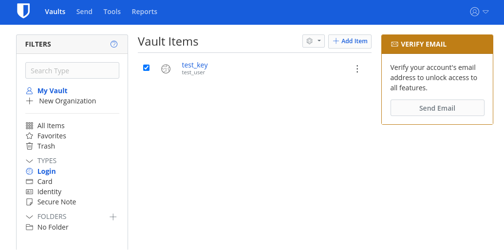
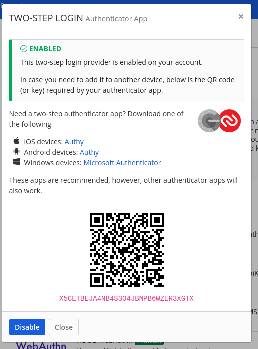
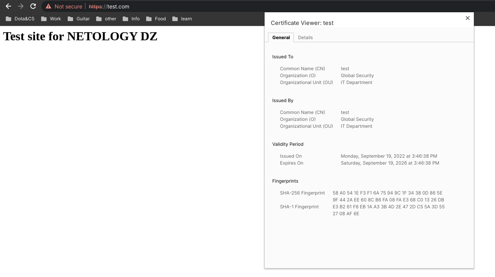
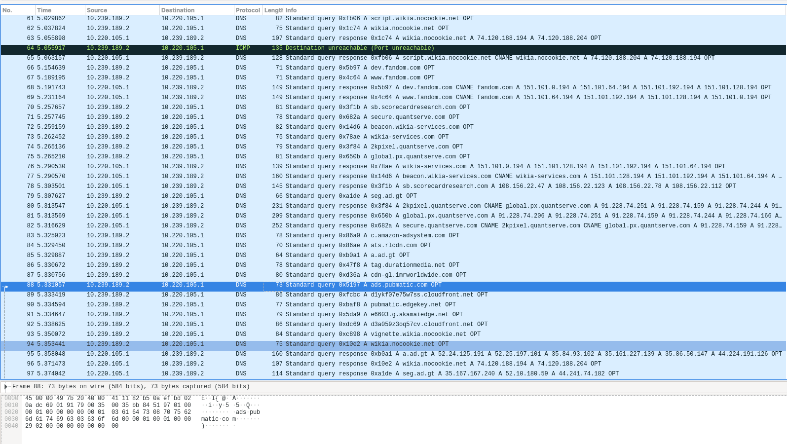

1. Зарегистрировал аккаунт Bitwarden и поставил плагин. Создал тестовую запись с паролем.

---
2. Подключил второй фактор OTP.

---
3. Apache поставил, сайт поднял.
Конфиг сайта
````
<VirtualHost *:443>
	# The ServerName directive sets the request scheme, hostname and port that
	# the server uses to identify itself. This is used when creating
	# redirection URLs. In the context of virtual hosts, the ServerName
	# specifies what hostname must appear in the request's Host: header to
	# match this virtual host. For the default virtual host (this file) this
	# value is not decisive as it is used as a last resort host regardless.
	# However, you must set it for any further virtual host explicitly.
	#ServerName www.example.com

	ServerAdmin webmaster@localhost
	DocumentRoot /var/www/test.com/public_html
	ServerName test.com
        ServerAlias www.test.com
	SSLEngine on
        SSLCertificateFile /etc/apache2/cert.pem
        SSLCertificateKeyFile /etc/apache2/cert.key
	# Available loglevels: trace8, ..., trace1, debug, info, notice, warn,
	# error, crit, alert, emerg.
	# It is also possible to configure the loglevel for particular
	# modules, e.g.
	#LogLevel info ssl:warn

	ErrorLog ${APACHE_LOG_DIR}/error.log
	CustomLog ${APACHE_LOG_DIR}/access.log combined

	# For most configuration files from conf-available/, which are
	# enabled or disabled at a global level, it is possible to
	# include a line for only one particular virtual host. For example the
	# following line enables the CGI configuration for this host only
	# after it has been globally disabled with "a2disconf".
	#Include conf-available/serve-cgi-bin.conf
</VirtualHost>

````
Скрин из браузера.

---
4. Проверил сайт dota2.ru. Найдены потенциальные уязвимости. 
````
vagrant@vagrant:/home/testdz_user/testssl.sh$ ./testssl.sh -U --sneaky https://dota2.ru/

###########################################################
    testssl.sh       3.2rc1 from https://testssl.sh/dev/

      This program is free software. Distribution and
             modification under GPLv2 permitted.
      USAGE w/o ANY WARRANTY. USE IT AT YOUR OWN RISK!

       Please file bugs @ https://testssl.sh/bugs/

###########################################################

 Using "OpenSSL 1.0.2-bad (1.0.2k-dev)" [~183 ciphers]
 on vagrant:./bin/openssl.Linux.x86_64
 (built: "Sep  1 14:03:44 2022", platform: "linux-x86_64")


 Start 2022-09-19 13:18:07        -->> 185.71.67.28:443 (dota2.ru) <<--

 rDNS (185.71.67.28):    --
 Service detected:       HTTP


 Testing vulnerabilities 

 Heartbleed (CVE-2014-0160)                not vulnerable (OK), no heartbeat extension
 CCS (CVE-2014-0224)                       not vulnerable (OK)
 Ticketbleed (CVE-2016-9244), experiment.  not vulnerable (OK)
 ROBOT                                     not vulnerable (OK)
 Secure Renegotiation (RFC 5746)           supported (OK)
 Secure Client-Initiated Renegotiation     not vulnerable (OK)
 CRIME, TLS (CVE-2012-4929)                not vulnerable (OK)
 BREACH (CVE-2013-3587)                    potentially NOT ok, "gzip" HTTP compression detected. - only supplied "/" tested
                                           Can be ignored for static pages or if no secrets in the page
 POODLE, SSL (CVE-2014-3566)               not vulnerable (OK)
 TLS_FALLBACK_SCSV (RFC 7507)              Downgrade attack prevention supported (OK)
 SWEET32 (CVE-2016-2183, CVE-2016-6329)    not vulnerable (OK)
 FREAK (CVE-2015-0204)                     not vulnerable (OK)
 DROWN (CVE-2016-0800, CVE-2016-0703)      not vulnerable on this host and port (OK)
                                           make sure you don't use this certificate elsewhere with SSLv2 enabled services, see
                                           https://search.censys.io/search?resource=hosts&virtual_hosts=INCLUDE&q=3AE5A4FB6715B8F35821E64CE4E395C77448814413517BADA98D8DE1D1DD5708
 LOGJAM (CVE-2015-4000), experimental      not vulnerable (OK): no DH EXPORT ciphers, no DH key detected with <= TLS 1.2
 BEAST (CVE-2011-3389)                     not vulnerable (OK), no SSL3 or TLS1
 LUCKY13 (CVE-2013-0169), experimental     potentially VULNERABLE, uses cipher block chaining (CBC) ciphers with TLS. Check patches
 Winshock (CVE-2014-6321), experimental    not vulnerable (OK)
 RC4 (CVE-2013-2566, CVE-2015-2808)        no RC4 ciphers detected (OK)

````
---
5. Создал пользователя коммандой ``sudo adduser testuser_dz`` на vagrant хосте test.com (который использовался для сайта).
Коммандой ``ssh-copy-id testdz_user@test.com`` скопировал свой паблик ED25519-SK ключ на хост test.com (использовал свой yubikey).
Подключился к хосту по ssh.
---
6. Подключился сразу по имени ``ssh testuser_dz@test.com ``.
---
7. Коммандой ``sudo tcpdump -c 100 -w test.pcap`` собрал pcap файл. 
Открыл в wireshark. 
