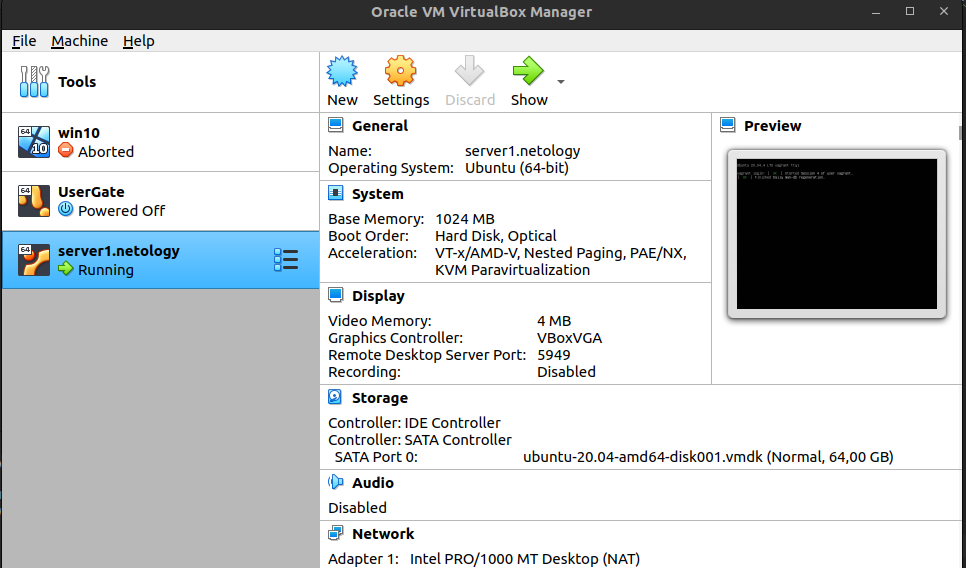

### Задача 1
- Снижение затрат на выполнение рутиных задач
- Автоматическое развертывание продукта
- Возможность быстро откатиться на предыдущую версиию

Обеспечение идемпотентности, на мой взгляд, является основополагающим принципо IaaC

---

### Задача 2

- Ansible написан на python и нативен для ОС семейства Linux. Не требует установленных агентов и использует SSH.
- Метод push, на мой взгляд, наиболее надежный т.к. он позволяет контролировать процесс конфигурации с центрального сервера,
а конфигурируемым хостам  при этом не нужен доступ к центральному серверу.

---

### Задача 3 

VirtualBox
```mfonarev@root-ubuntu:~$ VBoxManage --version
6.1.38r153438
```
Vagrant
```
mfonarev@root-ubuntu:~/Desktop/vagrant_files$ vagrant --version
Vagrant 2.2.19
```
Ansible
```
mfonarev@root-ubuntu:~/Desktop/vagrant_files$ ansible --version
ansible 2.10.8
  config file = None
  configured module search path = ['/home/mfonarev/.ansible/plugins/modules', '/usr/share/ansible/plugins/modules']
  ansible python module location = /usr/lib/python3/dist-packages/ansible
  executable location = /usr/bin/ansible
  python version = 3.10.6 (main, Aug 10 2022, 11:40:04) [GCC 11.3.0]

```

### Задача 4

```
vagrant@server1:~$ sudo docker ps
CONTAINER ID   IMAGE     COMMAND   CREATED   STATUS    PORTS     NAMES
```
