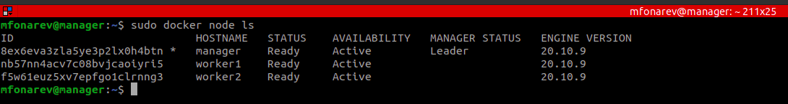
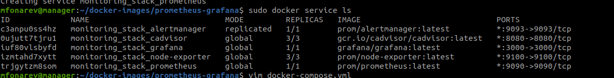

### Задача 1
Дайте письменые ответы на следующие вопросы:
1. В чём отличие режимов работы сервисов в Docker Swarm кластере: replication и global?
> Global это означает, что данный сервис будет запущен ровно в одном экземпляре на всех возможных нодах. 
Replicated означает, что X кол-во контейнеров для данного сервиса будет запущено на всех доступных нодах

2. Какой алгоритм выбора лидера используется в Docker Swarm кластере?
> Алгоритм консенсуса RAFT

3. Что такое Overlay Network?
> Насколько я понял, это виртуальная сеть, которая связывает контейнеры между различными хостами swarm кластера

---

### Задача 2
Создать ваш первый Docker Swarm кластер в Яндекс.Облаке
Для получения зачета, вам необходимо предоставить скриншот из терминала (консоли), с выводом команды:
````docker node ls````


---
### Задача 3
Создать ваш первый, готовый к боевой эксплуатации кластер мониторинга, состоящий из стека микросервисов.
Для получения зачета, вам необходимо предоставить скриншот из терминала (консоли), с выводом команды:


---
### Задача 4
Логи RAFT алгоритма шифрованы. Ключи шифрования находятся в памяти менеджеров.\
Это комманда отдает ключ разблокировки менеджера и блокирует менеджер. 

