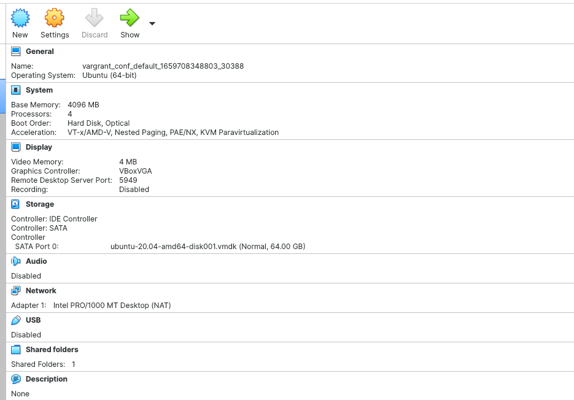

5. Ресурсы виртуально машины показаны на рисунке


---

6.Добавив в vagrantfile  
````
config.vm.provider "virtualbox" do |v| 
v.memory = 4096
v.cpus = 4`
````
---

8.
>***HISTSIZE***
>The  number  of commands to remember in the command history (see HISTORY below).  If the value is 0, commands are not saved in the history list.  Numeric values less than zero result in every command being saved on the
>history list (there is no limit).  The shell sets the default value to 500 after reading any startup files.

ignoreboth позволяет игнорировать space в начале команд а также повторяющиеся комманды.

---
9. {} нужно для указания спика 

> Compound Commands
       A compound command is one of the following.  In most cases a list in a command's description may be separated from the rest of the command by one or more newlines, and may be followed by a newline in place of a semicolon.

       (list) list is executed in a subshell environment (see COMMAND EXECUTION ENVIRONMENT below).  Variable assignments and builtin commands that affect the shell's environment do not remain in effect after the command  completes.
              The return status is the exit status of list.

       { list; }
              list  is  simply  executed in the current shell environment.  list must be terminated with a newline or semicolon.  This is known as a group command.  The return status is the exit status of list.  Note that unlike the
              metacharacters ( and ), { and } are reserved words and must occur where a reserved word is permitted to be recognized.  Since they do not cause a word break, they must be separated from list by  whitespace  or  another
              shell metacharacter.

---

10.**touch file{1..100000}
Создать 300000 файлов не получится из-за **bash: /usr/bin/touch: Argument list too long**

---
11. Условное выражение, проверяющие существует ли файл 
/tmp и является ли он директорией


[[ -d /tmp ]];echo $?
[[ -d /tmp1 ]];echo $?
Результат 0, т.к. комманды успешно выполнятся без кода ошибок.

---
12. + **mkdir /tmp/new_path_directory/**
    + **cp /bin/bash/ /tmp/new_path_directory/**
    + **export PATH="/tmp/new_path_directory/:$PATH"**

---

13. **at** используется для назначения одноразового задания на заданное время
**batch** — для назначения одноразовых задач, которые должны выполняться, когда загрузка системы становится меньше 0,8.
